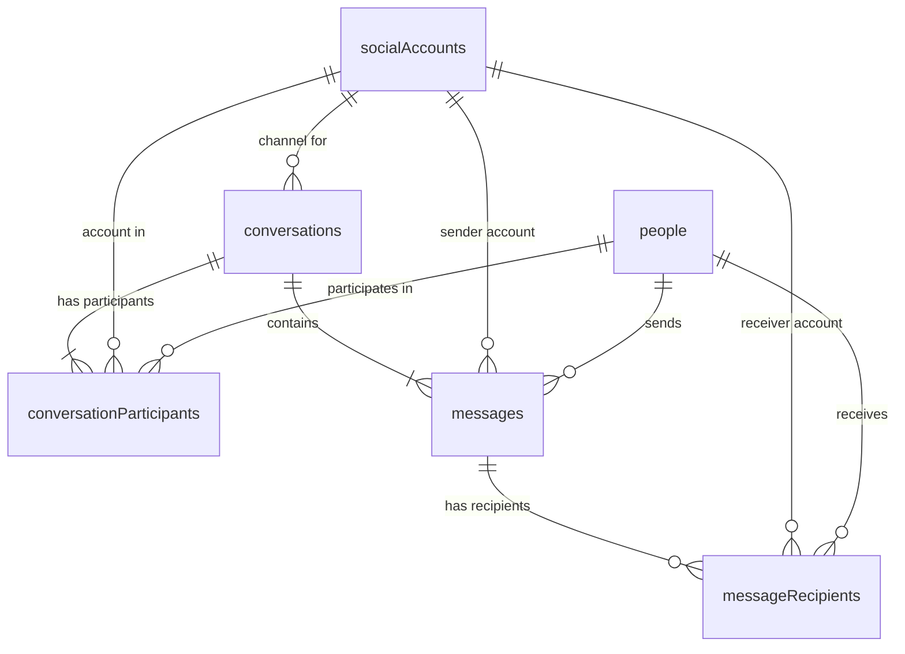

# Messages Feature Build Out

## Feature Overview

A unified messaging system for PRM that stores and organizes all forms of communication — **phone messages (SMS/texts)**, **Instagram DMs**, **emails**, and **future social media messages** (Discord, X, Facebook, etc.) — in a single, queryable structure.

Core capabilities:
- **Multi-channel**: One table handles every channel type. Adding a new social platform requires only a new `channelType` value.
- **To / From with multiple recipients**: Every message tracks a sender and one-or-more receivers, each linked to a `person` record and optionally to a `socialAccount`.
- **Conversation threading**: Messages are grouped into conversations representing a **short period of communication** (hours or days) — not an entire timeline. A single relationship may have many conversations over time.
- **Embedded tabs**: Message history surfaces directly inside **Person Profile** pages and **Social Account Profile** pages — no need to navigate away.
- **Standalone Messages page**: A top-level `/messages` list page for browsing, filtering, and searching across all conversations.

---

## Database Schema Extensions

All changes go in [shared/schema.ts](file:///c:/repo/PRM/shared/schema.ts). Three new tables are introduced.

### 1. `conversations` — Thread / chain container

```typescript
export const conversations = pgTable("conversations", {
  id: varchar("id").primaryKey().default(sql`gen_random_uuid()`),
  userId: integer("user_id").references(() => users.id, { onDelete: "cascade" }),
  title: text("title"),                          // Optional display name (e.g. email subject, group chat name)
  channelType: text("channel_type").notNull(),   // "phone" | "instagram" | "email" | "discord" | "x" | "facebook" | "generic"
  socialAccountId: varchar("social_account_id")  // Optional FK — set when conversation is tied to a specific social account
    .references(() => socialAccounts.id, { onDelete: "set null" }),
  externalUrl: text("external_url"),              // Optional link back to source (e.g. email chain URL, IG DM deep link)
  metadata: jsonb("metadata"),                   // Extensible JSON (e.g. email thread ID, IG thread ID)
  lastMessageAt: timestamp("last_message_at"),   // Denormalized for sort performance
  createdAt: timestamp("created_at").notNull().defaultNow(),
});
```

**`channelType` values** (open enum — stored as text, validated at app layer):

| Value | Meaning |
|-------|---------|
| `phone` | SMS / text message |
| `email` | Email |
| `instagram` | Instagram DM |
| `discord` | Discord DM / channel message |
| `x` | X (Twitter) DM |
| `facebook` | Facebook Messenger |
| `generic` | Catch-all for unsupported or future platforms |

> [!NOTE]
> `channelType` is a plain text field — **not** an enum — so new social platforms can be added without a migration. The app layer validates against a known list and falls back to `generic`.

> [!IMPORTANT]
> **Conversation scope**: A conversation is **not** the entire history of communication with a person. It represents a discrete, short-lived exchange — a text thread over a few hours, an email chain over a couple days, a DM session. The same two people may have dozens of separate conversations over time. This keeps conversations lightweight and browsable.

> [!NOTE]
> **`externalUrl`**: For email chains, this field stores a link back to the original email thread (e.g. a Gmail permalink). For social media DMs, it can hold a deep link to the conversation on the platform. This is optional and purely for reference — clicking it opens the source in a browser.

### 2. `messages` — Individual messages within a conversation

```typescript
export const messages = pgTable("messages", {
  id: varchar("id").primaryKey().default(sql`gen_random_uuid()`),
  conversationId: varchar("conversation_id").notNull()
    .references(() => conversations.id, { onDelete: "cascade" }),
  senderPersonId: varchar("sender_person_id")
    .references(() => people.id, { onDelete: "set null" }),
  senderSocialAccountId: varchar("sender_social_account_id")
    .references(() => socialAccounts.id, { onDelete: "set null" }),
  content: text("content"),                        // Message body (plain text or HTML for emails)
  contentType: text("content_type").notNull().default("text"),  // "text" | "html" | "media"
  imageUuids: text("image_uuids").array().default(sql`ARRAY[]::text[]`),  // Optional array of image UUIDs (references uploaded images)
  attachments: jsonb("attachments"),               // Array of { url, filename, mimeType, sizeBytes }
  externalId: text("external_id"),                 // Platform-specific message ID for dedup
  sentAt: timestamp("sent_at"),                    // When the message was actually sent (may differ from createdAt)
  metadata: jsonb("metadata"),                     // Extensible: read receipts, reactions, etc.
  createdAt: timestamp("created_at").notNull().defaultNow(),
});
```

### 3. `messageRecipients` — Recipient junction table (supports multiple receivers)

```typescript
export const messageRecipients = pgTable("message_recipients", {
  id: varchar("id").primaryKey().default(sql`gen_random_uuid()`),
  messageId: varchar("message_id").notNull()
    .references(() => messages.id, { onDelete: "cascade" }),
  personId: varchar("person_id")
    .references(() => people.id, { onDelete: "set null" }),
  socialAccountId: varchar("social_account_id")
    .references(() => socialAccounts.id, { onDelete: "set null" }),
  recipientType: text("recipient_type").notNull().default("to"),  // "to" | "cc" | "bcc" (cc/bcc relevant for email)
});
```

### 4. `conversationParticipants` — Who is part of a conversation

```typescript
export const conversationParticipants = pgTable("conversation_participants", {
  id: varchar("id").primaryKey().default(sql`gen_random_uuid()`),
  conversationId: varchar("conversation_id").notNull()
    .references(() => conversations.id, { onDelete: "cascade" }),
  personId: varchar("person_id")
    .references(() => people.id, { onDelete: "set null" }),
  socialAccountId: varchar("social_account_id")
    .references(() => socialAccounts.id, { onDelete: "set null" }),
  role: text("role").notNull().default("participant"),  // "participant" | "owner"
  joinedAt: timestamp("joined_at").notNull().defaultNow(),
});
```

### Insert Schemas & Types

```typescript
export const insertConversationSchema = createInsertSchema(conversations).omit({ id: true, createdAt: true });
export const insertMessageSchema = createInsertSchema(messages).omit({ id: true, createdAt: true });
export const insertMessageRecipientSchema = createInsertSchema(messageRecipients).omit({ id: true });
export const insertConversationParticipantSchema = createInsertSchema(conversationParticipants).omit({ id: true });

export type Conversation = typeof conversations.$inferSelect;
export type InsertConversation = z.infer<typeof insertConversationSchema>;
export type Message = typeof messages.$inferSelect;
export type InsertMessage = z.infer<typeof insertMessageSchema>;
export type MessageRecipient = typeof messageRecipients.$inferSelect;
export type InsertMessageRecipient = z.infer<typeof insertMessageRecipientSchema>;
export type ConversationParticipant = typeof conversationParticipants.$inferSelect;
export type InsertConversationParticipant = z.infer<typeof insertConversationParticipantSchema>;
```

### Entity Relationship Diagram



---

## Storage Layer Extensions

Add to [server/storage.ts](file:///c:/repo/PRM/server/storage.ts). Follow the existing pattern of `IStorage` interface + `DatabaseStorage` implementation.

### New `IStorage` Methods

```typescript
// ── Conversations ──
createConversation(data: InsertConversation): Promise<Conversation>;
getConversation(id: string): Promise<Conversation | undefined>;
getConversationsPaginated(offset: number, limit: number, filters?: {
  channelType?: string;
  personId?: string;
  socialAccountId?: string;
  search?: string;
}): Promise<{ conversations: ConversationWithParticipants[]; total: number }>;
updateConversation(id: string, data: Partial<InsertConversation>): Promise<Conversation>;
deleteConversation(id: string): Promise<void>;

// ── Conversation Participants ──
addConversationParticipant(data: InsertConversationParticipant): Promise<ConversationParticipant>;
removeConversationParticipant(conversationId: string, personId: string): Promise<void>;
getConversationParticipants(conversationId: string): Promise<ConversationParticipant[]>;

// ── Messages ──
createMessage(data: InsertMessage, recipients: InsertMessageRecipient[]): Promise<Message>;
getMessagesByConversation(conversationId: string, offset: number, limit: number): Promise<{ messages: MessageWithRecipients[]; total: number }>;
deleteMessage(id: string): Promise<void>;

// ── Cross-entity lookups ──
getConversationsByPerson(personId: string, offset: number, limit: number): Promise<{ conversations: ConversationWithParticipants[]; total: number }>;
getConversationsBySocialAccount(socialAccountId: string, offset: number, limit: number): Promise<{ conversations: ConversationWithParticipants[]; total: number }>;
```

### Composite Return Types

```typescript
type ConversationWithParticipants = Conversation & {
  participants: (ConversationParticipant & { person?: Person; socialAccount?: SocialAccount })[];
  lastMessage?: Message;
  messageCount: number;
};

type MessageWithRecipients = Message & {
  senderPerson?: Person;
  senderSocialAccount?: SocialAccount;
  recipients: (MessageRecipient & { person?: Person; socialAccount?: SocialAccount })[];
};
```

---

## API Endpoint Specifications

New route module: [server/routes/messages.ts](file:///c:/repo/PRM/server/routes/messages.ts)

Register in [server/routes.ts](file:///c:/repo/PRM/server/routes.ts):
```typescript
import { registerRoutes as registerMessages } from "./routes/messages";
// ...
registerMessages(app);
```

### Endpoints

| Method | Endpoint | Payload / Params | Response | Description |
|--------|----------|-----------------|----------|-------------|
| `GET` | `/api/conversations/paginated` | `?offset=0&limit=20&channelType=&personId=&socialAccountId=&search=` | `{ conversations, total }` | Paginated conversation list with filters |
| `GET` | `/api/conversations/:id` | — | `ConversationWithParticipants` | Single conversation with participants & last message |
| `POST` | `/api/conversations` | `{ title?, channelType, socialAccountId?, participantPersonIds[], participantSocialAccountIds[]? }` | `Conversation` | Create a new conversation |
| `PATCH` | `/api/conversations/:id` | `{ title?, channelType?, externalUrl? }` | `Conversation` | Update conversation metadata (including source link) |
| `DELETE` | `/api/conversations/:id` | — | `204` | Delete conversation and all its messages |
| `GET` | `/api/conversations/:id/messages` | `?offset=0&limit=50` | `{ messages, total }` | Paginated messages within a conversation |
| `POST` | `/api/conversations/:id/messages` | `{ senderPersonId?, senderSocialAccountId?, content, contentType?, imageUuids?[], attachments?, sentAt?, recipients: [{ personId?, socialAccountId?, recipientType? }] }` | `Message` | Add a message to a conversation |
| `DELETE` | `/api/messages/:id` | — | `204` | Delete a single message |
| `POST` | `/api/conversations/:id/participants` | `{ personId?, socialAccountId?, role? }` | `ConversationParticipant` | Add participant to conversation |
| `DELETE` | `/api/conversations/:id/participants/:personId` | — | `204` | Remove participant from conversation |
| `GET` | `/api/people/:id/conversations` | `?offset=0&limit=20` | `{ conversations, total }` | All conversations a person is involved in |
| `GET` | `/api/social-accounts/:id/conversations` | `?offset=0&limit=20` | `{ conversations, total }` | All conversations tied to a social account |

---

## Frontend User Interface Integration

### A. New Standalone Page — `/messages`

**File**: [client/src/pages/messages-list.tsx](file:///c:/repo/PRM/client/src/pages/messages-list.tsx) `[NEW]`

```
┌──────────────────────────────────────────────────────────────┐
│  Messages                                        [+ New]     │
├──────────────────────────────────────────────────────────────┤
│  Filter: [All ▾]  [Phone] [Email] [Instagram] [...]  🔍     │
├──────────────────────────────────────────────────────────────┤
│  ┌────────────────────────────────────────────────────────┐  │
│  │ 📱 John Doe, Jane Smith              2 hrs ago        │  │
│  │    Hey, are we still meeting tomorrow?                │  │
│  ├────────────────────────────────────────────────────────┤  │
│  │ 📧 RE: Project Update — Mike, Sarah   Yesterday       │  │
│  │    Attached the latest revision...                    │  │
│  ├────────────────────────────────────────────────────────┤  │
│  │ 📸 @johndoe ↔ @janedoe               3 days ago      │  │
│  │    Sent a reel                                        │  │
│  └────────────────────────────────────────────────────────┘  │
│                     [Load More]                              │
└──────────────────────────────────────────────────────────────┘
```

- Channel type icons: 📱 Phone · 📧 Email · 📸 Instagram · 💬 Generic
- Click a conversation → opens conversation detail view
- Floating "+ New" button → dialog to create a new conversation (pick channel, pick participants)

### B. Conversation Detail Page — `/messages/:id`

**File**: [client/src/pages/message-conversation.tsx](file:///c:/repo/PRM/client/src/pages/message-conversation.tsx) `[NEW]`

```
┌──────────────────────────────────────────────────────────────┐
│  ← Back   📱 John Doe, Jane Smith            [⚙ Edit] [🗑]  │
├──────────────────────────────────────────────────────────────┤
│                                                              │
│  ┌──────────────────────────┐                                │
│  │ John Doe   10:30 AM      │                                │
│  │ Hey, are we meeting?     │                                │
│  └──────────────────────────┘                                │
│                         ┌──────────────────────────┐         │
│                         │ You    10:32 AM          │         │
│                         │ Yes, 3pm at the café     │         │
│                         └──────────────────────────┘         │
│  ┌──────────────────────────┐                                │
│  │ Jane Smith  10:35 AM     │                                │
│  │ I'll be there too!       │                                │
│  └──────────────────────────┘                                │
│                                                              │
├──────────────────────────────────────────────────────────────┤
│  [+ Add Message]                                             │
└──────────────────────────────────────────────────────────────┘
```

- Chat-bubble style layout
- "+ Add Message" opens a compose form (pick sender from participants, write content, optional attachments)
- Messages are for **logging/recording** — not real-time chat

### C. Messages Tab — Person Profile Page

**Modified file**: [client/src/pages/person-profile.tsx](file:///c:/repo/PRM/client/src/pages/person-profile.tsx)

Add a **"Messages"** tab alongside existing tabs (Notes, Social, Family, etc.):

```
┌──────────────────────────────────────────────────────────────┐
│  John Doe                                                    │
│  [Overview] [Notes] [Social] [Family] [Messages] [...]       │
├──────────────────────────────────────────────────────────────┤
│  Messages                                    [+ New Message]  │
│  ┌─────────────────────────────────────────────────────────┐ │
│  │ 📱 with Jane Smith                    2 hrs ago         │ │
│  │    "Hey, are we still meeting?"                         │ │
│  ├─────────────────────────────────────────────────────────┤ │
│  │ 📧 RE: Project Update                Yesterday          │ │
│  │    "Attached the latest revision..."                    │ │
│  └─────────────────────────────────────────────────────────┘ │
└──────────────────────────────────────────────────────────────┘
```

- Uses `GET /api/people/:id/conversations` to fetch conversations involving this person
- Click → navigates to `/messages/:conversationId`

### D. Messages Tab — Social Account Profile Page

**Modified file**: [client/src/pages/social-account-profile.tsx](file:///c:/repo/PRM/client/src/pages/social-account-profile.tsx)

Add a **"Messages"** tab alongside existing tabs:

```
┌──────────────────────────────────────────────────────────────┐
│  @johndoe (Instagram)                                        │
│  [Overview] [Posts] [Network] [Messages]                     │
├──────────────────────────────────────────────────────────────┤
│  DM Conversations                           [+ New Message]  │
│  ┌─────────────────────────────────────────────────────────┐ │
│  │ 📸 @johndoe ↔ @janedoe              3 days ago          │ │
│  │    "Sent a reel"                                        │ │
│  └─────────────────────────────────────────────────────────┘ │
└──────────────────────────────────────────────────────────────┘
```

- Uses `GET /api/social-accounts/:id/conversations` to fetch conversations for this account
- Filtered to the social account's channel type by default

---

## New & Modified Files Summary

### New Files

| File | Purpose |
|------|---------|
| `server/routes/messages.ts` | All `/api/conversations/*` and `/api/messages/*` route handlers |
| `client/src/pages/messages-list.tsx` | Standalone messages list page |
| `client/src/pages/message-conversation.tsx` | Conversation detail / thread view |
| `client/src/components/messages-tab.tsx` | Reusable messages tab component (shared by person & social account profiles) |
| `client/src/components/new-conversation-dialog.tsx` | Dialog for creating a new conversation |
| `client/src/components/add-message-dialog.tsx` | Dialog for adding a message to an existing conversation |

### Modified Files

| File | Change |
|------|--------|
| `shared/schema.ts` | Add 4 new tables + insert schemas + types |
| `server/storage.ts` | Add `IStorage` methods + `DatabaseStorage` implementations |
| `server/routes.ts` | Import & register messages routes |
| `server/db-init.ts` | Ensure new tables are created on startup |
| `client/src/App.tsx` | Add `/messages` and `/messages/:id` routes |
| `client/src/pages/person-profile.tsx` | Add Messages tab |
| `client/src/pages/social-account-profile.tsx` | Add Messages tab |
| Navigation sidebar component | Add "Messages" menu item |

---

## Verification & Implementation Plan

### Phase 1: Database & Schema (Foundation)
1. Add all 4 tables to `shared/schema.ts`
2. Add insert schemas and exported types
3. Update `server/db-init.ts` to create tables on startup
4. Verify tables are created correctly by running the app

### Phase 2: Storage Layer
1. Add all new methods to the `IStorage` interface
2. Implement methods in `DatabaseStorage` class
3. Focus on join queries for composite return types (`ConversationWithParticipants`, `MessageWithRecipients`)

### Phase 3: API Routes
1. Create `server/routes/messages.ts` with all endpoints
2. Register in `server/routes.ts`
3. Test endpoints via HTTP client (Postman / curl)

### Phase 4: Frontend — Standalone Pages
1. Create `messages-list.tsx` with channel type filter bar and paginated list
2. Create `message-conversation.tsx` with chat-bubble thread view
3. Create shared dialog components (new conversation, add message)
4. Add routes to `App.tsx`
5. Add "Messages" to sidebar navigation

### Phase 5: Frontend — Profile Tab Integration
1. Build reusable `messages-tab.tsx` component
2. Integrate into `person-profile.tsx` as a new tab
3. Integrate into `social-account-profile.tsx` as a new tab

### Phase 6: Polish & QA
1. Verify multi-recipient conversations display correctly
2. Test all channel types (phone, email, Instagram, etc.)
3. Verify cascade deletes (deleting a person or social account handles messages gracefully)
4. Ensure pagination and filtering work across all views
5. UI polish — icons, empty states, loading skeletons

---

## Open Questions & Future Considerations

> [!IMPORTANT]
> **Import / sync**: Should messages eventually be importable from external sources (e.g. Instagram DM export, email IMAP, phone backup)? This plan covers manual entry only. Import pipelines would be a separate build-out.

> [!NOTE]
> **Attachments**: The `attachments` JSONB field stores metadata only. Actual files would go through the existing upload pipeline (`/uploads` or S3). This can be wired up in a follow-up.

> [!NOTE]
> **Search**: Full-text search across message content could be added later using PostgreSQL `tsvector` or the existing Qdrant vector infrastructure.

- **Real-time notifications**: Not in scope. This is a **message log** (CRM-style), not a live chat system.
- **Channel type extensibility**: New platforms are added by simply using a new `channelType` string value — no migrations needed.
- **"Self" identity**: For sent messages, the sender can be left `null` or linked to a special "self" person record, depending on user preference. This should be decided during implementation.
