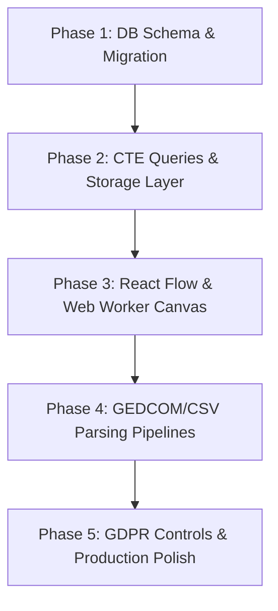

# Scalable Family Tree: Transition and Implementation Roadmap

This document outlines how the architectural ideas presented in [family-ext-guide.md](file:///c:/repo/PRM/Guides/family-ext-guide.md) will be implemented within the **PRM** codebase. It covers the database refactoring, backend traversal APIs, frontend rendering changes from Pixi.js to React Flow/ELK.js, and GDPR privacy workflows.

---

## 1. Current State vs. Proposed Architecture

| Architectural Layer | Current Implementation in PRM | Proposed Scalable Architecture |
| :--- | :--- | :--- |
| **Database Model** | Direct relationships between individuals (`relationships` table) with custom `familyRelationshipType`. | **Union-Centric Model**: Indirection via `unions` and junction tables (`person_unions`, `union_children`) to handle spouse/partner states natively. |
| **Dates Representation** | Standard database `TIMESTAMP` or string fields for vital dates. | **Fuzzy/Estimated Dates**: Composite dates (`date_string`, `date_sort`, `date_precision`) based on GEDCOM X. |
| **Graph Querying** | BFS recursion in application memory (`server/storage.ts:getFamilyTree`) with sequential queries. | **Recursive CTE Queries**: Graph traversal pushed to PostgreSQL database using recursion, cycle detection, and generation tracking. |
| **Rendering Canvas** | **Pixi.js** (`family-tree-canvas.tsx`) using manual coordinate offset layouts. | **React Flow (xyflow)** rendering DOM-based interactive nodes and SVG orthogonal edges. |
| **Layout Calculations** | Custom BFS-based layout positioning spouse/child offsets on the main thread. | **ELK.js (Eclipse Layout Kernel)** layered Sugiyama layout executed inside a background **Web Worker** (`elk-worker.js`). |
| **Data Portability** | Simple JSON imports and custom VCF/CSV parsers. | **GEDCOM 7.0/5.5.1 & Tabular CSV Support** via `@treeviz/gedcom-parser` with raw JSONB backup columns for lossless roundtrips. |
| **Privacy / compliance** | Minimal privacy filtering (tree matches database content). | **GDPR Guardrails**: Automated `is_living` flag determination, dynamic public PII masking, and data anonymization erasure workflows. |

---

## 2. Database Schema Refactoring (`shared/schema.ts`)

The current DB model in [schema.ts](file:///c:/repo/PRM/shared/schema.ts) represents family links as direct node-to-node relationships. To transition to a union-centric structure that supports complex configurations (spouses, step-relationships, pedigree collapse), we will apply the following Drizzle ORM modifications:

### A. New Table: `unions`
Acts as the hyperedge connecting spouses/partners and their children.
```typescript
export const unions = pgTable("unions", {
  id: varchar("id").primaryKey().default(sql`gen_random_uuid()`),
  unionType: varchar("union_type", { length: 50 }).notNull().default("marriage"), // 'marriage', 'domestic_partnership', 'civil_union', 'unknown'
  createdAt: timestamp("created_at").notNull().defaultNow(),
});
```

### B. New Junction Table: `person_unions`
Maps partners to their unions.
```typescript
export const personUnions = pgTable("person_unions", {
  personId: varchar("person_id").notNull().references(() => people.id, { onDelete: "cascade" }),
  unionId: varchar("union_id").notNull().references(() => unions.id, { onDelete: "cascade" }),
  role: varchar("role", { length: 50 }).notNull().default("partner"), // 'husband', 'wife', 'partner'
});
```

### C. New Junction Table: `union_children`
Links offspring to a specific union instead of individual parents.
```typescript
export const unionChildren = pgTable("union_children", {
  childId: varchar("child_id").notNull().references(() => people.id, { onDelete: "cascade" }),
  unionId: varchar("union_id").notNull().references(() => unions.id, { onDelete: "cascade" }),
  relType: varchar("rel_type", { length: 50 }).notNull().default("biological"), // 'biological', 'adopted', 'foster', 'step'
});
```

### D. New Table: `events`
Decouples dates from the people table to capture multiple conflicting events and fuzzy timestamps.
```typescript
export const events = pgTable("events", {
  id: varchar("id").primaryKey().default(sql`gen_random_uuid()`),
  personId: varchar("person_id").references(() => people.id, { onDelete: "cascade" }),
  unionId: varchar("union_id").references(() => unions.id, { onDelete: "cascade" }),
  eventType: varchar("event_type", { length: 50 }).notNull(), // 'birth', 'death', 'marriage', 'divorce'
  placeName: text("place_name"),
  
  // Tripartite date model for fuzzy dates
  dateString: text("date_string").notNull(), // e.g. "ABT 1845", "May 1862", "BET 1840 AND 1845"
  dateSort: timestamp("date_sort").notNull(), // Chronological sort value (e.g. 1845-01-01)
  datePrecision: varchar("date_precision", { length: 20 }).notNull(), // 'exact', 'year', 'month_year', 'range'
  
  createdAt: timestamp("created_at").notNull().defaultNow(),
});
```

### E. Modifying the Existing `people` Table
We will retain the `people` table (mapped to `people` in the DB), but we will update its definition to support the new metadata:
- **`isLiving`**: `boolean` (default: `true`) to govern PII visibility.
- **`rawGedcom`**: `jsonb` column to store vendor-specific or unrecognized GEDCOM tags.
- Note: We will gradually phase out direct child/parent columns in favor of the union tables.

### F. Fuzzy Date Parsing Utility (`shared/date-utils.ts`)
To map incoming fuzzy strings to the tripartite date model, we will implement a parser on the backend and shared layers:

```typescript
export interface ParsedFuzzyDate {
  dateString: string;
  dateSort: Date;
  datePrecision: "exact" | "year" | "month_year" | "range";
}

export function parseFuzzyDate(rawDateStr: string): ParsedFuzzyDate {
  const clean = rawDateStr.trim().toUpperCase();
  
  // 1. Year Range: "BET 1840 AND 1845"
  const rangeMatch = clean.match(/BET\s+(\d{4})\s+AND\s+(\d{4})/);
  if (rangeMatch) {
    const startYear = parseInt(rangeMatch[1], 10);
    return {
      dateString: rawDateStr,
      dateSort: new Date(`${startYear}-01-01T00:00:00Z`),
      datePrecision: "range",
    };
  }

  // 2. Modifiers: "ABT 1910", "EST 1890", "CAL 1860"
  const modifierMatch = clean.match(/(ABT|EST|CAL|AFT|BEF)\s+(.*)/);
  const targetDateStr = modifierMatch ? modifierMatch[2] : clean;
  
  // 3. Exact date parse attempts
  // Try YYYY-MM-DD
  if (/^\d{4}-\d{2}-\d{2}$/.test(targetDateStr)) {
    return {
      dateString: rawDateStr,
      dateSort: new Date(`${targetDateStr}T00:00:00Z`),
      datePrecision: modifierMatch ? "year" : "exact",
    };
  }
  
  // Try Month Year: "MAY 1862" or "05/1862"
  const monthYearMatch = targetDateStr.match(/([A-Z]{3,9}|\d{2})[\s/](\d{4})/);
  if (monthYearMatch) {
    const year = monthYearMatch[2];
    // Convert text month to numeric or default to Jan
    const month = "01"; 
    return {
      dateString: rawDateStr,
      dateSort: new Date(`${year}-${month}-01T00:00:00Z`),
      datePrecision: "month_year",
    };
  }

  // Try Year only: "1845"
  const yearMatch = targetDateStr.match(/^(\d{4})$/);
  if (yearMatch) {
    return {
      dateString: rawDateStr,
      dateSort: new Date(`${yearMatch[1]}-01-01T00:00:00Z`),
      datePrecision: "year",
    };
  }

  // Fallback to current date with "exact" precision if unparseable
  return {
    dateString: rawDateStr,
    dateSort: new Date(),
    datePrecision: "exact",
  };
}
```

---

## 3. Database Traversal using PostgreSQL Recursive CTE (`server/storage.ts`)

Instead of the BFS loop in [storage.ts:L1027-L1089](file:///c:/repo/PRM/server/storage.ts#L1027-L1089), which triggers multiple sequential database requests, we will write a single recursive Common Table Expression (CTE) query.

### A. Dual-Direction Traversal (Hourglass View)
An hourglass chart renders ancestors upward and descendants downward. In `server/storage.ts`, we will fetch both directions in a unified query or two parallel CTE queries.

```typescript
import { db } from "./db";
import { sql } from "drizzle-orm";

export interface GraphNodeResult {
  personId: string;
  depth: number;
  direction: "ancestor" | "descendant";
}

async function fetchHourglassGraph(rootId: string, ancestorDepth: number, descendantDepth: number): Promise<GraphNodeResult[]> {
  const query = sql`
    WITH RECURSIVE 
    ancestor_tree AS (
      -- 1. ANCESTOR ANCHOR
      SELECT 
        p.id as person_id,
        0 as depth,
        ARRAY[p.id::text] as visited_path
      FROM people p
      WHERE p.id = ${rootId}
      
      UNION ALL
      
      -- ANCESTOR RECURSION
      SELECT 
        pu.person_id,
        at.depth - 1 as depth,
        at.visited_path || pu.person_id::text
      FROM ancestor_tree at
      INNER JOIN union_children uc ON uc.child_id = at.person_id
      INNER JOIN person_unions pu ON pu.union_id = uc.union_id
      WHERE at.depth > -${ancestorDepth}
        AND NOT (pu.person_id::text = ANY(at.visited_path))
    ),
    
    descendant_tree AS (
      -- 2. DESCENDANT ANCHOR
      SELECT 
        p.id as person_id,
        0 as depth,
        ARRAY[p.id::text] as visited_path
      FROM people p
      WHERE p.id = ${rootId}
      
      UNION ALL
      
      -- DESCENDANT RECURSION
      SELECT 
        uc.child_id,
        dt.depth + 1 as depth,
        dt.visited_path || uc.child_id::text
      FROM descendant_tree dt
      INNER JOIN person_unions pu ON pu.person_id = dt.person_id
      INNER JOIN union_children uc ON uc.union_id = pu.union_id
      WHERE dt.depth < ${descendantDepth}
        AND NOT (uc.child_id::text = ANY(dt.visited_path))
    )
    
    -- COMBINE ANCESTORS AND DESCENDANTS
    SELECT DISTINCT person_id, depth, 'ancestor' as direction FROM ancestor_tree
    UNION
    SELECT DISTINCT person_id, depth, 'descendant' as direction FROM descendant_tree;
  `;
  
  const result = await db.execute(query);
  return result.rows as unknown as GraphNodeResult[];
}
```

---

## 4. Backend APIs and Data Pipelines (`server/routes.ts`)

The following server endpoints in [routes.ts](file:///c:/repo/PRM/server/routes.ts) will be updated:

### A. Family Tree JSON Serialization (`/api/family-tree/:personId`)
The output format will shift from direct relationships list to a structure supplying:
- **`people`**: List of individual node profiles.
- **`unions`**: List of unions connecting spouses.
- **`parentalEdges`**: Offspring pointing to `union_id` nodes.
- **`missingLinks`**: Virtual placeholding links for unknown co-parents, siblings, or ancestors.

### B. Lossless GEDCOM Parsing (`/api/import-gedcom`)
1. Integrate the lightweight `@treeviz/gedcom-parser` dependency in `package.json`.
2. Process `.ged` files by matching record structures:
   - **Pointer Dictionary**: Maintain a mapping table in memory (`@I123@ -> generated-uuid`) during parsing.
   - **`INDI` Parsing**: Read each individual, parse standard fields, run `parseFuzzyDate` on birth/death text, and write the full tag structure (unparsed) to `rawGedcom`.
   - **`FAM` Parsing**: Create a `unions` row. Join husband/wife IDs (from `@I...@` pointers) in `person_unions` with role `husband`/`wife`.
   - **`CHIL` Parsing**: Read child pointer IDs nested inside the family record, and add them to `union_children` targeting the corresponding `union_id`.

```typescript
// Conceptual snippet inside /api/import-gedcom handler:
import { parseGedcom } from "@treeviz/gedcom-parser";

app.post("/api/import-gedcom", upload.single("file"), async (req, res) => {
  const gedcomString = req.file.buffer.toString("utf-8");
  const parsed = parseGedcom(gedcomString);
  const idMap = new Map<string, string>(); // GEDCOM ID -> DB UUID

  // Step 1: Create Persons
  for (const indi of parsed.individuals) {
    const dbPerson = await storage.createPerson({
      firstName: indi.name.given,
      lastName: indi.name.surname,
      sex: indi.sex,
      rawGedcom: indi.rawTags, // Lossless backup
    });
    idMap.set(indi.id, dbPerson.id);

    // Save Birth/Death events
    if (indi.birth) {
      const parsedDate = parseFuzzyDate(indi.birth.date);
      await storage.createEvent({
        personId: dbPerson.id,
        eventType: "birth",
        placeName: indi.birth.place,
        dateString: parsedDate.dateString,
        dateSort: parsedDate.dateSort,
        datePrecision: parsedDate.datePrecision,
      });
    }
  }

  // Step 2: Create Unions and link Spouses & Children
  for (const fam of parsed.families) {
    const union = await storage.createUnion({ unionType: "marriage" });
    
    if (fam.husband) {
      const husbUuid = idMap.get(fam.husband);
      if (husbUuid) await storage.createPersonUnion(husbUuid, union.id, "husband");
    }
    if (fam.wife) {
      const wifeUuid = idMap.get(fam.wife);
      if (wifeUuid) await storage.createPersonUnion(wifeUuid, union.id, "wife");
    }
    
    for (const childId of fam.children) {
      const childUuid = idMap.get(childId);
      if (childUuid) await storage.createUnionChild(childUuid, union.id, "biological");
    }
  }
  
  res.json({ success: true, count: parsed.individuals.length });
});
```

### C. GDPR Compliance Controls
1. **Automated `isLiving` check**: A database trigger or database hook will analyze `events` records on create/update:
   - If a `death` event exists, `isLiving = false`.
   - If a `birth` event sort date exceeds 110 years ago, `isLiving = false`.
   - Else, default to `true`.
2. **Obfuscation Filter**: Create an Express middleware/helper in `routes.ts`:
   - If a public/unauthenticated request reads the family tree, intercept the JSON payload.
   - For all nodes with `isLiving = true`, overwrite `firstName = "Living"`, `lastName = "Person"`, and nullify `email`, `phone`, `socialAccountUuids`, and vital date strings.
3. **Anonymized Erasure Endpoint (`POST /api/people/:id/erase`)**:
   - Instead of standard cascade deletion (which breaks the layout of descendant branches), wipe names/PII fields and convert the node into an anonymous placeholder (`isLiving = false`).

---

## 5. Visual Rendering and Layout Canvas (`client/src`)

The existing canvas in [family-tree-canvas.tsx](file:///c:/repo/PRM/client/src/components/family-tree-canvas.tsx) relies on Pixi.js. To support orthogonal drawing, spouse alignment, and massive sub-graphs, we will replace the Pixi.js engine with **React Flow** and **ELK.js**.

### A. React Flow & Custom Nodes Integration
We will configure `ReactFlow` with custom node templates:
- **`PersonNode`**: Standard styled HTML component displaying avatars, name templates, dates, and action drawers.
- **`UnionNode`**: Dimensionless invisible HTML placeholder (typically a small 4x4px dot) representing marriage connections, keeping spouses centered horizontally.
- **`EdgeStyles`**: Custom edge components rendering orthogonal routes down from spouse unions to children.

### B. Asynchronous Layout using Web Workers
To calculate node coordinates without freezing the browser's UI thread, we will offload layout mathematics to a Web Worker.

1. **Create Web Worker (`public/elk-worker.js`)**:
```javascript
import ELK from 'elkjs/lib/elk.bundled.js';
const elk = new ELK();

self.onmessage = async (event) => {
  const { graph } = event.data;
  try {
    const layoutGraph = await elk.layout(graph, {
      layoutOptions: {
        'org.eclipse.elk.algorithm': 'layered',
        'org.eclipse.elk.direction': 'DOWN',
        'org.eclipse.elk.edgeRouting': 'ORTHOGONAL',
        'org.eclipse.elk.layered.layering.layerConstraint': 'SAME_LAYER',
        'org.eclipse.elk.spacing.nodeSelfLoop': '20',
        'org.eclipse.elk.spacing.nodeNode': '40',
        'org.eclipse.elk.spacing.edgeEdge': '15',
        'org.eclipse.elk.layered.crossingMinimization.forceNodeModelOrder': 'true',
      }
    });
    self.postMessage({ success: true, layoutGraph });
  } catch (error) {
    self.postMessage({ success: false, error: error.message });
  }
};
```

2. **Trigger layout in `family-tree-canvas.tsx`**:
```typescript
useEffect(() => {
  if (!data) return;
  
  const worker = new Worker('/elk-worker.js');
  const elkGraph = transformToElkFormat(data);
  
  worker.postMessage({ graph: elkGraph });
  worker.onmessage = (e) => {
    if (e.data.success) {
      const { nodes, edges } = mapElkToReactFlow(e.data.layoutGraph);
      setNodesState(nodes);
      setEdgesState(edges);
    }
    worker.terminate();
  };
  
  return () => worker.terminate();
}, [data]);
```

### C. Web Worker Graph Payload Structure (ELK JSON Format)
Below is an example of the structured JSON schema that the frontend maps from DB records and sends to the Web Worker for layout:

```json
{
  "id": "root",
  "children": [
    { "id": "p1", "width": 160, "height": 80 },
    { "id": "p2", "width": 160, "height": 80 },
    { 
      "id": "u1", 
      "width": 10, 
      "height": 10, 
      "layoutOptions": {
        "org.eclipse.elk.layered.layering.layerConstraint": "SAME_LAYER"
      }
    },
    { "id": "c1", "width": 160, "height": 80 }
  ],
  "edges": [
    { "id": "e_p1_u1", "sources": ["p1"], "targets": ["u1"] },
    { "id": "e_p2_u1", "sources": ["p2"], "targets": ["u1"] },
    { "id": "e_u1_c1", "sources": ["u1"], "targets": ["c1"] }
  ]
}
```

### D. Custom React Flow Edge Styling (Biological vs. Adopted Relationships)
To distinguish between biological lines and adopted/foster lines visually, we will implement a custom edge component `FamilyEdge.tsx` that changes path rendering based on `relType` metadata:

```typescript
import { getBezierPath, EdgeProps } from "@xyflow/react";

export default function FamilyEdge({
  id,
  sourceX,
  sourceY,
  targetX,
  targetY,
  sourcePosition,
  targetPosition,
  data,
}: EdgeProps<{ relType?: string }>) {
  const [edgePath] = getBezierPath({
    sourceX,
    sourceY,
    sourcePosition,
    targetX,
    targetY,
    targetPosition,
  });

  const relType = data?.relType ?? "biological";
  
  // Style configurations
  let strokeDasharray = undefined;
  let strokeColor = "#6b7280"; // neutral grey
  let strokeWidth = 2;

  if (relType === "adopted") {
    strokeDasharray = "5,5";
    strokeColor = "#8b5cf6"; // purple-tinted line
  } else if (relType === "foster") {
    strokeDasharray = "2,4";
    strokeColor = "#3b82f6"; // blue-tinted line
  } else if (relType === "step") {
    strokeDasharray = "4,2";
    strokeColor = "#f59e0b"; // amber-tinted line
  }

  return (
    <path
      id={id}
      className="react-flow__edge-path"
      d={edgePath}
      stroke={strokeColor}
      strokeWidth={strokeWidth}
      strokeDasharray={strokeDasharray}
      fill="none"
    />
  );
}
```

### E. Zustand Client State Management
We will introduce a Zustand store (`client/src/lib/store.ts` or inline context) to keep track of coordinate arrays:
- Allows smooth node dragging: when a user drags a person node, Zustand catches the manual `x, y` updates, suppresses automatic ELK.js layouts for that node, and updates only surrounding edges.
- Stores current expansion toggle status to load sub-graph components (e.g. Hourglass chart boundaries).

### F. Visual Export (PNG / PDF)
We will leverage `html-to-image` and `jsPDF` inside [family-tree.tsx](file:///c:/repo/PRM/client/src/pages/family-tree.tsx):
- Clone the React Flow viewport element.
- Inject active CSS configurations.
- Serialize CSS to canvas data URL.
- Feed canvas PNG output into jsPDF letter/A4 sizes.

---

## 6. AI and Propagation Logic Refactoring (`server/family-propagation.ts` & `server/family-tree-ai.ts`)

The AI helper [family-tree-ai.ts](file:///c:/repo/PRM/server/family-tree-ai.ts) and relationship analyzer [family-propagation.ts](file:///c:/repo/PRM/server/family-propagation.ts) currently work with direct relationships. They must be modified:
1. **Propagation Updates**: Changing relationships (like declaring a child) must automatically:
   - Identify or create a `unions` record connecting the child's parents.
   - Insert entries into `union_children` linking the child to that union.
2. **AI JSON Suggestions**: The schema generated by Ollama in `/api/family-tree/ai/generate` will be mapped from raw relationship objects (`"from": "Sam", "to": "Don", "type": "father"`) into backend db transactions that execute the union-centric creation logic.

---

## 7. Step-by-Step Implementation Roadmap



### Phase 1: Database Refactoring & Schema Updates
- Add `unions`, `person_unions`, `union_children`, and `events` tables in [shared/schema.ts](file:///c:/repo/PRM/shared/schema.ts).
- Add `isLiving` and `rawGedcom` columns to the `people` table.
- Generate and run database migrations using `npm run db:push`.

### Phase 2: Graph Querying & Traversal Upgrade
- Write recursive CTE SQL queries in [server/storage.ts](file:///c:/repo/PRM/server/storage.ts) for ancestor and descendant traversals.
- Integrate visited array mapping inside CTE to ensure infinite loop prevention.
- Update `/api/family-tree/:personId` endpoints in [server/routes.ts](file:///c:/repo/PRM/server/routes.ts).

### Phase 3: React Flow & Canvas Implementation
- Install `@xyflow/react` and `elkjs`.
- Replace Pixi.js Canvas in [family-tree-canvas.tsx](file:///c:/repo/PRM/client/src/components/family-tree-canvas.tsx) with React Flow.
- Deploy the layout calculations inside `elk-worker.js`.
- Connect Zustand coordinate mapping for user manual adjustments.

### Phase 4: Data Import/Export Pipelines
- Implement backend `.ged` upload stream processing with `@treeviz/gedcom-parser`.
- Support exporting standard `GEDCOM 5.5.1/7.0` and CSV sheets.
- Implement HTML-to-Image / PDF visual snapshot actions.

### Phase 5: Privacy Controls & Optimization
- Set up default obfuscation routes for public shares checking `isLiving`.
- Add right-to-erasure anonymization routes.
- Implement React.memo optimization to avoid edge layout re-draws during canvas pans.

---

## 8. Automated Testing & Validation Strategy

To prevent regressions in layout math, graph loops, and GDPR privacy leakage, we will implement a multi-layered automated suite.

### A. CTE Loop-Break Database Unit Tests (`tests/db-cte.test.ts`)
Validates that our recursive CTE queries do not enter infinite loops when encountering pedigree collapse or circular imports:

```typescript
import { db } from "../server/db";
import { fetchHourglassGraph } from "../server/storage";
import { people, unions, personUnions, unionChildren } from "../shared/schema";

describe("PostgreSQL CTE Traversal & Cycle Breaking", () => {
  it("should terminate query and return accurate nodes when pedigree collapse occurs", async () => {
    // 1. Setup cyclic structure: Child marrying cousin, or descendant loop
    const [p1] = await db.insert(people).values({ firstName: "Grandfather", lastName: "Loop" }).returning();
    const [p2] = await db.insert(people).values({ firstName: "Father", lastName: "Loop" }).returning();
    
    // Create union (Grandfather + Unknown) -> Father
    const [u1] = await db.insert(unions).values({}).returning();
    await db.insert(personUnions).values({ personId: p1.id, unionId: u1.id });
    await db.insert(unionChildren).values({ childId: p2.id, unionId: u1.id });

    // Force circular linkage (Child is parent of grandfather)
    const [u2] = await db.insert(unions).values({}).returning();
    await db.insert(personUnions).values({ personId: p2.id, unionId: u2.id });
    await db.insert(unionChildren).values({ childId: p1.id, unionId: u2.id });

    // 2. Query traversal
    const results = await fetchHourglassGraph(p1.id, 5, 5);
    
    // 3. Assertions
    expect(results.length).toBeLessThan(10); // Loop broken, didn't loop infinitely
    const foundIds = results.map(r => r.personId);
    expect(foundIds).toContain(p1.id);
    expect(foundIds).toContain(p2.id);
  });
});
```

### B. GDPR Information Leakage API Integration Tests (`tests/api-gdpr.test.ts`)
Asserts that live relative details are correctly stripped for unauthenticated requests:

```typescript
import request from "supertest";
import app from "../server/routes";

describe("GET /api/family-tree/:personId - Public Obfuscation", () => {
  it("should mask all living individuals' details for unauthenticated requests", async () => {
    const response = await request(app)
      .get("/api/family-tree/test-root-uuid")
      .expect(200);

    const data = response.body;
    
    // Scan all returned people nodes
    for (const node of data.people) {
      if (node.isLiving) {
        expect(node.firstName).toBe("Living");
        expect(node.lastName).toBe("Person");
        expect(node.email).toBeNull();
        expect(node.phone).toBeNull();
      }
    }
  });
});
```

### C. Headless Layout Non-Overlapping Regression Tests (`tests/layout.test.ts`)
Processes a complex mock pedigree through ELK.js in a Node environment and programmatically checks that bounding boxes of adjacent spouse and child nodes do not overlap:

```typescript
import ELK from "elkjs";
const elk = new ELK();

describe("Headless Layout Coordinate Integrity", () => {
  it("calculates clean grid spacing without node bounding box overlap", async () => {
    const mockGraph = {
      id: "root",
      children: [
        { id: "p1", width: 160, height: 80 },
        { id: "p2", width: 160, height: 80 },
        { id: "u1", width: 10, height: 10 }
      ],
      edges: [
        { id: "e1", sources: ["p1"], targets: ["u1"] },
        { id: "e2", sources: ["p2"], targets: ["u1"] }
      ]
    };

    const layout = await elk.layout(mockGraph);
    const p1Coord = layout.children?.find(c => c.id === "p1");
    const p2Coord = layout.children?.find(c => c.id === "p2");

    expect(p1Coord).toBeDefined();
    expect(p2Coord).toBeDefined();

    // Check that p1 and p2 are separated by at least the node width
    const distance = Math.abs(p1Coord!.x! - p2Coord!.x!);
    expect(distance).toBeGreaterThanOrEqual(160 + 20); // 160 width + spouse gap
  });
});
```

