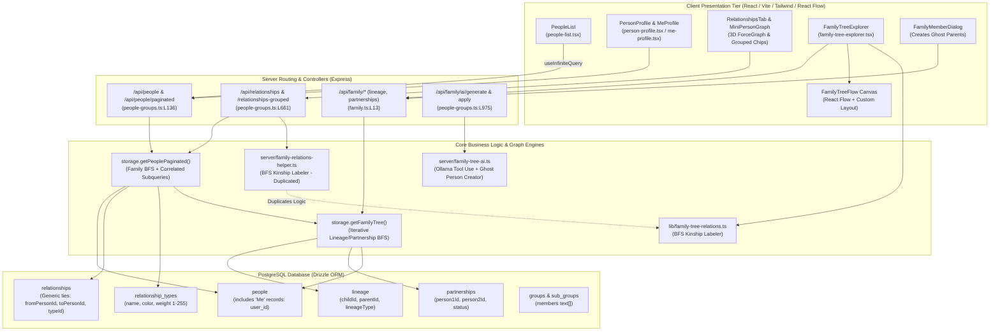

# Technical Audit: People, Bidirectional Relationships & Family Tree Architecture

**Auditor:** Full-Stack Systems, Kinship Modeling & Graph Architecture Specialist  
**Target Repository:** `PRM (Personal Relationship Manager)`  
**Scope:** People Registry, Contact Profiles, ME User Ecosystem, Generic Bidirectional Relationships, Lineage & Partnerships, Kinship BFS Solvers, Family Tree Flow Visualizer, and AI Family Topology Generation  
**Target File:** `c:\Repos\PRM\good-bad-ugly\03-people-relationships-family.md`  

---

## Executive Summary

The People, Relationships, and Family Tree subsystems form the primary domain model of the PRM application. These modules track individual human identities ([`people-list.tsx`](file:///c:/Repos/PRM/client/src/pages/people-list.tsx), [`person-profile.tsx`](file:///c:/Repos/PRM/client/src/pages/person-profile.tsx)), link them to authenticated users via a dedicated "ME" person identity ([`me-profile.tsx`](file:///c:/Repos/PRM/client/src/pages/me-profile.tsx)), model multi-directional social ties with user-defined weights and color palettes ([`relationships-tab.tsx`](file:///c:/Repos/PRM/client/src/components/relationships-tab.tsx), [`relationship-types-list.tsx`](file:///c:/Repos/PRM/client/src/pages/relationship-types-list.tsx)), and construct complex multi-generational family trees with automatic kinship translation and React Flow visualization ([`family-tree-flow.tsx`](file:///c:/Repos/PRM/client/src/components/family-tree-flow.tsx), [`family-tree-explorer.tsx`](file:///c:/Repos/PRM/client/src/components/family-tree-explorer.tsx), [`family-relations-helper.ts`](file:///c:/Repos/PRM/server/family-relations-helper.ts)).

The domain modeling exhibits several commendable architectural choices—particularly the clean separation of generic social relationships from biological/legal genealogy (`relationships` vs. `lineage` and `partnerships`), the integration of a 3D force-directed mini-graph, and an extensible BFS kinship label compiler. 

However, critical architectural flaws, catastrophic sorting bottlenecks, memory leaks, and severe database vulnerabilities undermine the integrity and scalability of the subsystem:
1. **Unbounded In-Memory Data Operations & Heap Ingestion:** The search route (`/api/people/search?connected_to_me=true`) ingests the entire `relationships` database table into Node.js heap memory to perform JavaScript `.filter()` calls. In `deletePerson`, the server selects **every group in the entire database** and loops through them in JavaScript to execute individual sequential SQL updates.
2. **Pathological Query Cascades on Paginated Lists:** Every 30-item page request to `/api/people/paginated` triggers an unbounded recursive BFS family tree traversal for the ME user (`getFamilyTree(mePersonId, 2)`), computes dynamic kinship labels, constructs dynamic SQL `IN (...)` arrays, and executes correlated scalar subqueries containing `MAX(...)` inside `SELECT` clauses across the entire `people` table.
3. **Severe Multi-Spouse Layout Collapse:** In [`family-tree-flow.tsx`](file:///c:/Repos/PRM/client/src/components/family-tree-flow.tsx), couple groupings are indexed in a 1-to-1 lookup map (`personCouple`). When any individual has multiple partners (e.g., an ex-spouse and a current spouse), the lookup map is overwritten. This causes the individual to be duplicated across multiple React Flow parent groups, inducing coordinate desynchronization, overlapping visual collisions, and rendering engine exceptions.
4. **Synthetic "Ghost Person" Database Pollution:** Both the AI relationship generator ([`family-tree-ai.ts`](file:///c:/Repos/PRM/server/family-tree-ai.ts)) and the manual UI ([`family-member-dialog.tsx`](file:///c:/Repos/PRM/client/src/components/family-member-dialog.tsx)) handle sibling linkages without known parents by inserting real, persistent placeholder records into the database `people` table named `"Parent of <A> & <B>"`. These phantom contacts pollute search results, contact lists, and global directory indices.
5. **Security & Authorization Void on Deletions:** `DELETE /api/people/:id` lacks any ownership verification or protection for system-critical accounts. Any authenticated user can delete any other user's contacts or even their own or another user's "Me" record, permanently corrupting `/api/me` into a 404 lockup state with no recovery mechanism.

---

## Subsystem Architectural Map



---

## 1. The Good: Architectural Highlights & Strengths

### 1.1 Separation of Generic Relationships and Kinship Lineage
Rather than attempting to shoehorn genealogical relationships into a flat graph table, the application establishes a clean architectural separation:
- **Generic Social Relationships** ([`shared/schema.ts:L270-L285`](file:///c:/Repos/PRM/shared/schema.ts#L270-L285)): Stored in `relationships`, linking `fromPersonId` and `toPersonId` with a foreign key to `relationship_types`. This accommodates non-hierarchical, weighted social ties (e.g., "Colleague", "Mentor", "Acquaintance") with customizable colors and priority values (1–255).
- **Formal Genealogy** ([`shared/schema.ts:L288-L311`](file:///c:/Repos/PRM/shared/schema.ts#L288-L311)): Decomposed into normalized primitives:
  - `lineage`: Strictly models direct parent-child edges (`childId`, `parentId`, `lineageType: 'biological' | 'adoptive' | 'step'`) with a database-level unique constraint `unique(childId, parentId)`.
  - `partnerships`: Strictly models co-parental and spousal ties (`person1Id`, `person2Id`, `status: 'married' | 'partner' | 'divorced' | 'ex_partner'`) with `unique(person1Id, person2Id)`.
This separation avoids overloading generic relationship tables with complex genealogical constraints.

### 1.2 "ME" User Identity & Multi-User Boundary Scoping
The contact management model gracefully handles multi-tenant identity attribution:
- [`shared/schema.ts:L171`](file:///c:/Repos/PRM/shared/schema.ts#L171) binds a person record to an authenticated user account via `userId: integer("user_id").references(() => users.id, { onDelete: "cascade" })`.
- A partial unique index [`uniqueIndex("people_me_user_id_uniq").on(t.userId).where(sql'user_id IS NOT NULL')`](file:///c:/Repos/PRM/shared/schema.ts#L200) guarantees that each registered user has exactly one "ME" contact persona, while preserving unconstrained creation of non-ME contacts.
- In [`server/storage.ts:L1026-L1034`](file:///c:/Repos/PRM/server/storage.ts#L1026-L1034), list queries filter out only the *caller's own* ME record while exposing other users' ME records (subject to visibility rules). This enables multi-user PRM deployments where users can discover and relate to one another.

### 1.3 Grouped Bidirectional Relationship Representation
In [`server/routes/people-groups.ts:L714-L783`](file:///c:/Repos/PRM/server/routes/people-groups.ts#L714-L783), the endpoint `GET /api/people/:personId/relationships-grouped` aggregates a person's incoming and outgoing links into a single payload:
- It maps relationship types into categorized buckets (`groupsMap`), decorated with custom hex colors and numeric sort values.
- In [`client/src/components/relationships-tab.tsx:L175-L235`](file:///c:/Repos/PRM/client/src/components/relationships-tab.tsx#L175-L235), contacts render as distinct colored chips with dynamic foreground text contrast calculated via luminance coefficients (`getReadableTextColor`).
- An embedded 3D force-directed canvas ([`client/src/components/mini-person-graph.tsx`](file:///c:/Repos/PRM/client/src/components/mini-person-graph.tsx)) uses `3d-force-graph` to visually render the person at the center of an orbit with color-coded directional neighbor links.

### 1.4 Algorithmic Kinship Translation via BFS Traversal
The system avoids storing hundreds of static relationship permutation rows (e.g., "Grandmother", "Great-Aunt", "Second Cousin Once Removed") by computing them dynamically:
- [`server/family-relations-helper.ts:L169-L215`](file:///c:/Repos/PRM/server/family-relations-helper.ts#L169-L215) builds an in-memory adjacency list from lineage and partnerships, executing a Breadth-First Search (BFS) from the root person.
- Step paths are normalized into base categories (`parent`, `child`, `sibling`, `spouse`) and mapped via [`PATH_MAP`](file:///c:/Repos/PRM/server/family-relations-helper.ts#L50-L79) against sex definitions (`male`, `female`, `neutral`).
- Generational multipliers dynamically handle arbitrarily deep direct lines (`"Great-".repeat(g - 2) + "Grandfather"`), while modifiers (`Step-`, `Adoptive `, `Half-`) are applied based on path metadata.

---

## 2. The Bad: State Management Complexity, Inefficiencies & Code Smells

### 2.1 Catastrophic Backend Inefficiencies in `/api/people/paginated`
The pagination endpoint ([`server/routes/people-groups.ts:L136-L156`](file:///c:/Repos/PRM/server/routes/people-groups.ts#L136-L156) calling [`server/storage.ts:L957-L1050`](file:///c:/Repos/PRM/server/storage.ts#L957-L1050)) incurs massive database overhead for every single batch of 30 contacts:

```typescript
// server/storage.ts:L966-L974
if (mePersonId) {
  try {
    const familyTree = await this.getFamilyTree(mePersonId, 2);
    familyLabels = computeFamilyLabels(mePersonId, familyTree);
    familyIds = Array.from(familyLabels.keys());
  } catch (err) {
    console.error("Error fetching family tree in getPeoplePaginated:", err);
  }
}
```

1. **Repetitive Multi-Table BFS Traversal:** For every page scrolled in [`people-list.tsx`](file:///c:/Repos/PRM/client/src/pages/people-list.tsx), `getFamilyTree(mePersonId, 2)` queries the database across `lineage` and `partnerships` through multiple BFS frontier iterations to construct the ME user's family tree from scratch.
2. **Correlated Scalar Subqueries Inside Aggregates:** The SQL query executed for every page contains multiple correlated scalar subqueries embedded inside `MAX()` expressions to resolve `typeName` and `typeColor`:
   ```sql
   -- server/storage.ts:L988-L1005
   MAX(CASE WHEN relationship_types.value = (
     SELECT MAX(rt2.value) 
     FROM relationship_types rt2 
     INNER JOIN relationships r2 ON rt2.id = r2.type_id 
     WHERE ((r2.from_person_id = people.id AND r2.to_person_id = $mePersonId) OR ...)
   ) THEN relationship_types.name ELSE NULL END)
   ```
   Furthermore, `groupCount` executes another correlated subquery:
   ```sql
   -- server/storage.ts:L1006-L1010
   (SELECT COUNT(*)::int FROM groups WHERE people.id = ANY(members))
   ```
3. **Hardcoded Family Score Overrides:** In [`storage.ts:L977-L980`](file:///c:/Repos/PRM/server/storage.ts#L977-L980) and [`L1058-L1062`](file:///c:/Repos/PRM/server/storage.ts#L1058-L1062), any person present in `familyIds` is artificially forced to a relationship value of `90`. If a contact has an explicit relationship type with value $\le 90$, the family badge silently overrides it; if the value is $> 90$, the family relationship is completely masked in the list.

### 2.2 Illusion of Global Table Sorting in `people-list.tsx`
In [`client/src/pages/people-list.tsx:L165-L217`](file:///c:/Repos/PRM/client/src/pages/people-list.tsx#L165-L217), column headers (Name, Relationship, Tags, Phone, Email, Social) offer interactive sort indicators. However:
- Sorting is executed strictly **client-side** on `data?.pages.flat()`:
  ```typescript
  // client/src/pages/people-list.tsx:L174-L176
  const sortedPeople = useMemo(() => {
    if (!tableSortColumn) return people;
    return [...people].sort((a, b) => { ... });
  }, [people, tableSortColumn, tableSortDirection, starredStates]);
  ```
- Because the page uses `useInfiniteQuery` fetching in 30-item chunks, clicking "Name" merely sorts the currently loaded 30 records in browser memory. A contact whose name starts with "A" residing on page 5 will never be sorted to the top until the user manually scrolls down to page 5. This breaks standard data table sorting contracts.

### 2.3 Massive Logic Duplication Between Client and Server
The entire kinship resolution logic exists in duplicate across the codebase:
- Server: [`server/family-relations-helper.ts`](file:///c:/Repos/PRM/server/family-relations-helper.ts) (216 lines)
- Client: [`client/src/lib/family-tree-relations.ts`](file:///c:/Repos/PRM/client/src/lib/family-tree-relations.ts) (224 lines)

Both files implement identical `PATH_MAP` objects, `getStepCategory` string matchers, `applyModifiers` prefixes, `translateRelationshipPath` resolvers, and BFS traversal loops. Because neither imports from a common module in `@shared`, any bug fixes or kinship rule additions (such as the 5-step `"Second Cousin"` mapping added to the client in [`family-tree-relations.ts:L81`](file:///c:/Repos/PRM/client/src/lib/family-tree-relations.ts#L81)) do not propagate to the server, resulting in inconsistent relationship labels between the profile page and the tree canvas.

### 2.4 Cache Invalidation Mismatches
When performing mutations across relationships and people, React Query cache keys are inconsistently invalidated:
- In [`PersonTagsCell`](file:///c:/Repos/PRM/client/src/components/person-tags-cell.tsx#L40-L44), updating a contact's tags invalidates `["/api/people", personId]`, `["/api/people"]`, and `["/api/groups"]`, but fails to invalidate `["/api/people/paginated"]`. As a result, the People List view retains stale tag displays until a hard refresh.
- In [`AddConnectionDialog`](file:///c:/Repos/PRM/client/src/components/add-connection-dialog.tsx#L81-L84), creating a generic relationship invalidates `["/api/graph"]` and `["/api/people"]`, but fails to invalidate `["/api/people", personId, "relationships-grouped"]` or `["/api/people/paginated"]`.
- In [`RelationshipDialog`](file:///c:/Repos/PRM/client/src/components/relationship-dialog.tsx#L151-L154), bulk-adding relationships triggers individual sequential `POST /api/relationships` calls (`Promise.all(promises)`) instead of a single batch endpoint, firing repetitive server-side invalidations.

### 2.5 Loss of Semantic Directionality in Generic Relationships
The `relationship_types` schema ([`shared/schema.ts:L260-L267`](file:///c:/Repos/PRM/shared/schema.ts#L260-L267)) has no concept of inverse or reciprocal titles. 
- When Person A creates a relationship to Person B with type "Manager" or "Teacher", the storage layer stores `fromPersonId = A, toPersonId = B, typeId = Manager`.
- When Person B views their profile, `storage.getPersonById` loads `relationshipsTo` and sets `toPerson = A` without reversing the title. Both Person A and Person B see each other labeled as "Manager". 
- Only family relationships have hardcoded inverse derivations ([`shared/schema.ts:L9-L11`](file:///c:/Repos/PRM/shared/schema.ts#L9-L11)); generic social relationships completely lack directional semantics.

### 2.6 Context Menu Hover Storm
In [`client/src/components/person-context-menu.tsx:L44-L73`](file:///c:/Repos/PRM/client/src/components/person-context-menu.tsx#L44-L73), the hook `usePersonMeRelationship` activates upon cursor hover:
```typescript
const { data: meUser } = useQuery({ queryKey: ["/api/me"], enabled: isHovered });
const { data: relationshipTypes } = useQuery({ queryKey: ["/api/relationship-types"], enabled: isHovered });
const { data: relationships } = useQuery({ queryKey: [`/api/relationships/${personId}`], enabled: isHovered });
```
When a user moves the cursor down a list of 30 people in [`people-list.tsx`](file:///c:/Repos/PRM/client/src/pages/people-list.tsx), each row triggers the hover callback, firing 30 discrete HTTP requests to `/api/relationships/:personId` within seconds.

---

## 3. The Ugly: Critical Architectural Flaws, UI Freezes & Vulnerabilities

### 3.1 React Flow Canvas Collapse on Multiple Spouses
In [`client/src/components/family-tree-flow.tsx:L498-L526`](file:///c:/Repos/PRM/client/src/components/family-tree-flow.tsx#L498-L526), couple grouping relies on a 1-to-1 lookup map:

```typescript
// client/src/components/family-tree-flow.tsx:L498-L516
const coupleSet = new Set<string>();
const personCouple = new Map<string, string>(); // ❌ Maps personId -> coupleKey 1:1

for (const [personId, spouseIds] of spouses) {
  for (const spouseId of spouseIds) {
    const key = [personId, spouseId].sort().join(":");
    if (!coupleSet.has(key) && generations.get(personId) === generations.get(spouseId)) {
      coupleSet.add(key);
      personCouple.set(personId, key); // ❌ Overwrites previous spouse!
      personCouple.set(spouseId, key);
      ...
    }
  }
}
```

#### The Failure Cascade:
1. If Person A has two partners (e.g., Ex-Spouse B and Current Spouse C), the loop processes `key = "A:B"` and executes `personCouple.set(A, "A:B")`. When it reaches Spouse C, it overwrites `personCouple.set(A, "A:C")`.
2. In the generational unit layout ([`family-tree-flow.tsx:L544-L558`](file:///c:/Repos/PRM/client/src/components/family-tree-flow.tsx#L544-L558)):
   - When Person B is processed, `personCouple.get(B)` returns `"A:B"`. A couple unit with IDs `[A, B]` is created.
   - When Person C (or A) is processed, `personCouple.get(C)` returns `"A:C"`. A couple unit with IDs `[A, C]` is created.
3. Person A is now placed into **two different couple groups**.
4. When React Flow nodes are instantiated ([`family-tree-flow.tsx:L778-L782`](file:///c:/Repos/PRM/client/src/components/family-tree-flow.tsx#L778-L782)), Person A's node is given `parentId: personToGroupId.get(A)`. Because `personToGroupId` only holds the last processed group ID (`couple-A:C`), Person A is rendered with relative coordinates inside Group `A:C`, but its positional slot in Group `A:B` remains an empty ghost.
5. In React Flow, this creates coordinate translation collisions, severe layout distortions, and unhandled rendering exceptions whenever anyone with more than one marriage is loaded into the canvas.

### 3.2 Server-Side Lineage Cycle Vulnerability
While [`family-tree-explorer.tsx:L291-L318`](file:///c:/Repos/PRM/client/src/components/family-tree-explorer.tsx#L291-L318) performs client-side cycle validation (`isAncestor`), the server endpoint provides zero protection:

```typescript
// server/routes/family.ts:L104-L123
app.post("/api/family/lineage", async (req, res) => {
  try {
    const bodySchema = z.object({
      childId: z.string().min(1),
      parentId: z.string().min(1),
      lineageType: z.enum(["biological", "adoptive", "step"]),
    });
    const body = bodySchema.parse(req.body);

    if (body.childId === body.parentId) {
      return res.status(400).json({ error: "Cannot create lineage link to self" });
    }

    const lin = await storage.createLineage(body); // ❌ ZERO cycle validation!
    res.status(201).json(lin);
...
```

If an external integration, mobile client, data import, or Ollama AI execution submits a cycle (e.g., Person A is parent of Person B, Person B is parent of Person C, and Person C is parent of Person A):
- The server stores the cyclic rows.
- During family tree queries ([`storage.ts:L1642-L1708`](file:///c:/Repos/PRM/server/storage.ts#L1642-L1708)), while `visitedPeople` terminates BFS at `maxDepth`, the cyclic lineage corrupts generation tracking.
- In `computeFamilyLabels` ([`family-relations-helper.ts:L194-L212`](file:///c:/Repos/PRM/server/family-relations-helper.ts#L194-L212)), the first path visited sets the kinship title. An ancestor can end up permanently labeled as their own "Grandson" or "Son", and React Flow generational assignment ([`family-tree-flow.tsx:L409-L441`](file:///c:/Repos/PRM/client/src/components/family-tree-flow.tsx#L409-L441)) assigns conflicting negative and positive generation indices to the same individuals.

### 3.3 Synthetic "Ghost Parent" Pollution of Core People Registry
Because the database models genealogy strictly as direct parent-child pairs (`lineage`), linking two people as siblings requires either referencing an existing shared parent or creating one.
Instead of treating siblinghood as a first-class relationship or using a dedicated virtual linkage, both the frontend dialog and the AI tool inject synthetic records directly into the live `people` table:

```typescript
// client/src/components/family-member-dialog.tsx:L216-L235
} else {
  // Create a placeholder parent first
  const createdParent = await createPersonMutation.mutateAsync({
    firstName: "Parent of",
    lastName: personName ? personName.split(" ").slice(1).join(" ") : "",
    sex: "unknown",
  });
  // Link selected person to this parent
  await apiRequest("POST", "/api/family/lineage", { childId: personId, parentId: createdParent.id, ... });
  // Link new sibling to this parent
  await apiRequest("POST", "/api/family/lineage", { childId: targetPersonId, parentId: createdParent.id, ... });
}
```
The exact same anti-pattern is implemented in [`server/family-tree-ai.ts:L619-L634`](file:///c:/Repos/PRM/server/family-tree-ai.ts#L619-L634):
```typescript
const placeholder = await storage.createPerson({
  firstName: "Parent of",
  lastName: `${change.fromPersonName} & ${change.newPerson?.firstName ?? change.toPersonName ?? "Sibling"}`,
} as any);
```

#### Consequences:
- Every time a user connects two siblings without knowing their parents, a permanent contact named `"Parent of John Doe & Jane Doe"` is written to the database.
- These ghost contacts appear in `/api/people/paginated`, are suggested in search auto-completes, appear in group member selection lists, and are entered into ELO pairwise rating pools ([`people-groups.ts:L158`](file:///c:/Repos/PRM/server/routes/people-groups.ts#L158)).
- They have no email, phone, or identity, yet cascade across all CRM operations.

### 3.4 Un-deletable Synthesized Sibling Edges
In [`server/storage.ts:L1810-L1813`](file:///c:/Repos/PRM/server/storage.ts#L1810-L1813), `getFamilyTree` synthesizes sibling edges on the fly:
```typescript
treeRelationships.push(
  { id: `sib_${A.id}_${B.id}`, fromPersonId: A.id, toPersonId: B.id, familyRelationshipType: roleAB },
  { id: `sib_${B.id}_${A.id}`, fromPersonId: B.id, toPersonId: A.id, familyRelationshipType: roleBA }
);
```
When a user clicks "Delete Connection" on a sibling edge in [`family-tree-explorer.tsx`](file:///c:/Repos/PRM/client/src/components/family-tree-explorer.tsx), the client calls `DELETE /api/relationships/:id` passing `sib_<A>_<B>`.
In [`server/routes/people-groups.ts:L906-L937`](file:///c:/Repos/PRM/server/routes/people-groups.ts#L906-L937):
```typescript
app.delete("/api/relationships/:id", async (req, res) => {
  const id = req.params.id;
  if (id.endsWith("_p") || id.endsWith("_c")) { ... await storage.deleteLineage(...); return res.json(...); }
  if (id.endsWith("_s1") || id.endsWith("_s2")) { ... await storage.deletePartnership(...); return res.json(...); }

  // ❌ Sibling IDs starting with "sib_" are completely unhandled!
  const rel = await storage.getRelationshipById(id); // returns undefined!
  await storage.deleteRelationship(id); // no-op!
  res.json({ success: true });
});
```
The server returns `{ success: true }`, but **does nothing**. The underlying `lineage` rows linking the two individuals to their shared parent are untouched. Upon page refresh, the sibling edge reappears, making sibling connections permanently un-deletable from the Family Tree UI.

### 3.5 Authorization Void on Contact & "Me" Deletions
In [`server/routes/people-groups.ts:L412-L430`](file:///c:/Repos/PRM/server/routes/people-groups.ts#L412-L430):
```typescript
app.delete("/api/people/:id", async (req, res) => {
  try {
    const id = req.params.id;
    const [personRow] = await db.select({ vectorId: people.vectorId }).from(people).where(eq(people.id, id));
    ...
    await storage.deletePerson(id);
    ...
    res.json({ success: true });
```
1. **Zero Access Control:** There is no check verifying that `req.user.id === person.createdByUserId` or that the user has administrative privileges. In a shared or multi-user deployment, any authenticated user can delete any other user's private contacts by sending a `DELETE` request with their UUID.
2. **Account Bricking via "Me" Deletion:** There is no guard checking `people.userId IS NOT NULL`. If a user deletes their own "Me" persona (or another user's "Me" persona), the record is deleted. Subsequent calls to `GET /api/me` ([`server/routes/auth-setup.ts:L2565-L2581`](file:///c:/Repos/PRM/server/routes/auth-setup.ts#L2565-L2581)) return HTTP 404. [`me-profile.tsx`](file:///c:/Repos/PRM/client/src/pages/me-profile.tsx) permanently renders an error screen with no automated re-creation or recovery workflow.
3. **Subgroup Orphan Leak:** In [`server/storage.ts:L1228-L1246`](file:///c:/Repos/PRM/server/storage.ts#L1228-L1246), `deletePerson` removes the person from `interactions` and `groups.members`, but **completely ignores `sub_groups.members`**. Deleted person IDs remain permanently stranded in subgroup member arrays.

### 3.6 Full Table Heap Scans in Database Search & Delete
Two operations bypass SQL filtering and execute unbounded in-memory processing:
- **Search Connected to Me:** In [`server/routes/people-groups.ts:L231-L250`](file:///c:/Repos/PRM/server/routes/people-groups.ts#L231-L250):
  ```typescript
  if (connectedToMe === 'true') {
    ...
    const allRelationships = await storage.getAllRelationships(); // ❌ Fetches EVERY relationship in DB!
    const meRelationships = allRelationships.filter(
      rel => rel.fromPersonId === mePerson.id || rel.toPersonId === mePerson.id
    );
    ...
  }
  ```
  Instead of executing `SELECT * FROM relationships WHERE from_person_id = $1 OR to_person_id = $1`, the controller loads every single relationship row across all users into the Node.js process heap and filters them using JavaScript `.filter()`.
- **Full Groups Loop on Contact Deletion:** In [`server/storage.ts:L1233-L1242`](file:///c:/Repos/PRM/server/storage.ts#L1233-L1242):
  ```typescript
  const allGroups = await db.select().from(groups); // ❌ Fetches EVERY group in DB!
  for (const group of allGroups) {
    if (group.members && group.members.includes(id)) {
      const updatedMembers = group.members.filter((memberId) => memberId !== id);
      await db.update(groups).set({ members: updatedMembers }).where(eq(groups.id, group.id));
    }
  }
  ```
  Instead of a single indexed PostgreSQL query (`UPDATE groups SET members = array_remove(members, $id) WHERE $id = ANY(members)`), this function loads every group into memory and issues $O(N)$ sequential network roundtrips.

---

## 4. Actionable Remediation Roadmap

### Phase 1: High Priority (Crash Prevention & Data Integrity)
1. **Fix Multi-Spouse Layout Collapse:**
   - In [`client/src/components/family-tree-flow.tsx`](file:///c:/Repos/PRM/client/src/components/family-tree-flow.tsx), replace the 1-to-1 `personCouple = new Map<string, string>()` with a 1-to-many structure (`personCouples = new Map<string, Set<string>>()`).
   - Allow individuals with multiple partners to be treated as independent generational units or duplicate anchor nodes with visual cross-link indicators, ensuring a single React Flow node is never claimed by multiple parent groups.
2. **Server-Side Ancestry Cycle Guard:**
   - In [`server/routes/family.ts`](file:///c:/Repos/PRM/server/routes/family.ts), implement an asynchronous cycle detection check in `POST /api/family/lineage` before inserting rows. Traverse upwards from `parentId` to confirm `childId` is not reachable. Return HTTP 400 with `"Lineage cycle detected: cannot make an ancestor into a descendant"` upon violation.
3. **Handle Sibling Deletions Correctly:**
   - Update `DELETE /api/relationships/:id` in [`server/routes/people-groups.ts`](file:///c:/Repos/PRM/server/routes/people-groups.ts) to parse IDs starting with `sib_`. Locate the shared lineage parent records linking the two siblings and delete or update the corresponding lineage edge.
4. **Protect "Me" Persona and Authorize Deletions:**
   - In `DELETE /api/people/:id`, add an explicit guard: `if (person.userId !== null) return res.status(403).json({ error: "Cannot delete user ME identity record" })`.
   - Validate that the calling user owns the record or has admin role before proceeding with deletion.

### Phase 2: Medium Priority (Architecture Cleanup & Query Optimization)
1. **Unify Kinship Engines in Shared Library:**
   - Consolidate [`server/family-relations-helper.ts`](file:///c:/Repos/PRM/server/family-relations-helper.ts) and [`client/src/lib/family-tree-relations.ts`](file:///c:/Repos/PRM/client/src/lib/family-tree-relations.ts) into a single isomorphic module: `shared/kinship.ts`.
   - Export shared types, `PATH_MAP`, translation functions, and BFS algorithms so client and server run byte-for-byte identical kinship logic.
2. **Eliminate Ghost Parent Record Creation:**
   - Refactor the sibling linkage architecture. Rather than generating synthetic `"Parent of ..."` database rows in `people`, introduce an explicit `sibling_groups` table or support direct sibling/co-lineage edges that render in the family tree without polluting the CRM contact directory.
3. **Optimize `getPeoplePaginated`:**
   - Remove the un-cached `getFamilyTree(mePersonId, 2)` call from the core pagination loop. Cache the ME user's direct family IDs in Redis or in-memory LRU with cache invalidation on lineage mutations.
   - Replace correlated subqueries in `SELECT` with a single left join against an indexed aggregation view or pre-computed materialized relationship cache.
4. **Eliminate Full-Table Memory Scans:**
   - Rewrite `GET /api/people/search?connected_to_me=true` to query relationships directly in SQL:
     ```sql
     SELECT DISTINCT CASE WHEN from_person_id = $1 THEN to_person_id ELSE from_person_id END
     FROM relationships WHERE from_person_id = $1 OR to_person_id = $1
     ```
   - In `deletePerson`, replace the full `groups` table scan with an atomic `array_remove` update on both `groups` and `sub_groups`.

### Phase 3: Low Priority (UX & Architectural Polish)
1. **Server-Driven People List Sorting:**
   - Update `GET /api/people/paginated` to accept `sortColumn` and `sortDirection` parameters so table header clicks sort the complete database table via SQL `ORDER BY` rather than slicing the first 30 in-memory contacts.
2. **Directional Semantics for Generic Relationships:**
   - Enhance `relationship_types` schema with an optional `inverseTypeId: varchar("inverse_type_id")` or `inverseName: text("inverse_name")`. 
   - When displaying relationships on Person B's profile for an incoming edge from Person A, render the inverse label (e.g. "Mentor" $\rightarrow$ "Mentee", "Manager" $\rightarrow$ "Direct Report").
3. **Debounce Context Menu Hover Prefetches:**
   - In [`person-context-menu.tsx`](file:///c:/Repos/PRM/client/src/components/person-context-menu.tsx), debounce the hover event by 200ms or defer fetching relationship state until the dropdown/context menu is explicitly opened.
