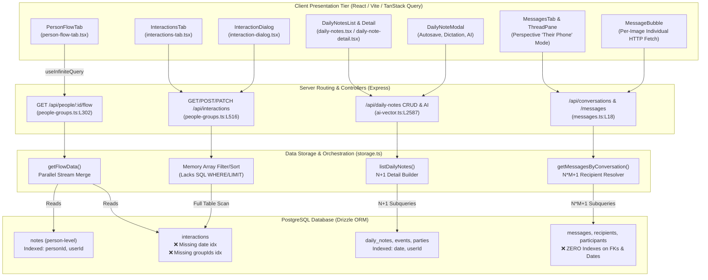

# Technical Audit: Interactions, Daily Notes, Messages & Unified Timeline Flow

**Auditor:** Full-Stack Systems, Communication & Timeline Architecture Specialist  
**Target Repository:** `PRM (Personal Relationship Manager)`  
**Scope:** Interactions Engine, Daily Notes Journaling, Unified Person Flow, Direct Messages & Communication Logs  
**Target File:** `c:\Repos\PRM\good-bad-ugly\04-interactions-notes-flow.md`  

---

## Executive Summary

The communication and chronological journaling systems in PRM form the operational backbone of the application. They allow users to track real-world meetings and calls ([`interaction-dialog.tsx`](file:///c:/Repos/PRM/client/src/components/interaction-dialog.tsx)), keep date-anchored reflective journal entries with AI event extraction and audio dictation ([`daily-notes.tsx`](file:///c:/Repos/PRM/client/src/pages/daily-notes.tsx), [`daily-note-modal.tsx`](file:///c:/Repos/PRM/client/src/components/daily-note-modal.tsx)), inspect conversation threads imported from platforms like Instagram or SMS ([`messages-tab.tsx`](file:///c:/Repos/PRM/client/src/components/messages-tab.tsx), [`conversation-thread-pane.tsx`](file:///c:/Repos/PRM/client/src/components/conversation-thread-pane.tsx)), and view an aggregated timeline via the Unified Flow ([`person-flow-tab.tsx`](file:///c:/Repos/PRM/client/src/components/person-flow-tab.tsx)).

While the subsystem provides ambitious functionality—such as subject-perspective rendering ("viewing their phone"), multi-party meeting attribution, local LLM structured event extraction, and speech-to-text dictation—the technical implementation suffers from critical architectural anti-patterns, severe database bottlenecks, and data synchronization gaps:
1. **Database Indexing Void:** Critical tables (`messages`, `message_recipients`, `conversation_participants`, `interactions`) completely lack indexes on foreign keys, thread IDs, timestamps, and group arrays. Queries across these tables force full table scans across the entire database.
2. **Extreme $N+1$ Query Cascades:** Both `getMessagesByConversation` and `listDailyNotes` fire dozens to hundreds of discrete SQL queries per HTTP request, triggering severe Node.js event-loop and connection-pool starvation.
3. **In-Memory Table Scanning:** The core endpoint `GET /api/interactions` queries the **entire** interactions table into Node.js heap memory, performing entity filtering, date range checks, sorting, and pagination slices using JavaScript arrays instead of database SQL clauses.
4. **Architectural Disconnect in Unified Flow:** Despite being billed as a unified chronological stream for notes, interactions, and messages, `getFlowData` completely omits `messages` and `daily_notes`. Furthermore, the flow cursor pagination suffers from timestamp-boundary item dropping and future-event exclusion, while click handlers on the person profile are non-functional empty stubs.

---

## Architectural Map of the Subsystem



---

## 1. The Good: Architectural Highlights & Strengths

### 1.1 Multi-Entity Interactions with Strict Schema Validation
Unlike basic CRM systems that restrict interactions to single contact links, PRM treats interactions as collaborative events across multiple participants and groups:
- [`shared/schema.ts:L238-L257`](file:///c:/Repos/PRM/shared/schema.ts#L238-L257) uses a PostgreSQL native array `people_ids text[]` and an optional `group_ids text[]`.
- [`shared/schema.ts:L1101-L1114`](file:///c:/Repos/PRM/shared/schema.ts#L1101-L1114) enforces that interactions require at least two people (`z.array(z.string()).min(2, "At least 2 people are required")`), reflecting true interpersonal dynamics.
- A dedicated PostgreSQL GIN index (`interactions_people_ids_gin_idx`) is provisioned on `peopleIds` to enable high-speed array containment searches (`@>` / `ANY`).
- Clean separation of taxonomy: Interaction types are independently categorized and color-coded with customizable numeric importance weights (1–255) via [`interaction-types-list.tsx`](file:///c:/Repos/PRM/client/src/pages/interaction-types-list.tsx).

### 1.2 Rich Daily Journaling with Multi-Modal AI Features
The Daily Notes architecture ([`client/src/pages/daily-notes.tsx`](file:///c:/Repos/PRM/client/src/pages/daily-notes.tsx) and [`client/src/components/daily-note-modal.tsx`](file:///c:/Repos/PRM/client/src/components/daily-note-modal.tsx)) is exceptionally comprehensive:
- **Date-Anchored Journaling:** Notes are strictly anchored to days (`YYYY-MM-DD`), preventing redundant fragmentation and providing chronological anchors.
- **PIN-Guarded Edit Window:** Notes within 48 hours are directly editable; entries older than 2 days become locked to protect journal historical integrity, requiring a user-configured cryptographic PIN to unlock ([`daily-note-detail.tsx:L99-L116`](file:///c:/Repos/PRM/client/src/pages/daily-note-detail.tsx#L99-L116)).
- **Integrated Browser Dictation:** [`DailyNoteModal`](file:///c:/Repos/PRM/client/src/components/daily-note-modal.tsx#L280-L315) implements native audio recording via the `MediaRecorder` API (`audio/webm` or `audio/ogg`), streaming multipart audio directly to the Whisper-backed endpoint `POST /api/daily-notes/transcribe` ([`server/routes/ai-vector.ts:L2685`](file:///c:/Repos/PRM/server/routes/ai-vector.ts#L2685)) with caret-position transcript insertion.
- **Structured Event Extraction:** Integration with local Ollama LLMs using JSON Schema formatting (`POST /api/daily-notes/generate-events` in [`server/routes/ai-vector.ts:L2599-L2648`](file:///c:/Repos/PRM/server/routes/ai-vector.ts#L2599-L2648)) parses freeform narrative entries into discrete, position-ranked daily event items (`daily_note_events`).

### 1.3 Perspective Messaging ("Their Phone") View
The messages architecture introduces an innovative perspective mode in [`client/src/components/messages-tab.tsx`](file:///c:/Repos/PRM/client/src/components/messages-tab.tsx#L45-L69) and [`client/src/components/conversation-thread-pane.tsx`](file:///c:/Repos/PRM/client/src/components/conversation-thread-pane.tsx#L116-L128):
- When inspecting another person's profile, rather than displaying messages from the PRM owner's standpoint, the thread switches to **subject-perspective**: messages sent by that person (or any of their linked Instagram/social handles) render on the right, while incoming messages from counterparts render on the left.
- Dynamic sender resolution aggregates multiple social accounts owned by the contact ([`person.socialAccountUuids`](file:///c:/Repos/PRM/client/src/components/messages-tab.tsx#L54-L57)), correctly handling platform-specific imports from Instagram DM JSON exports.

### 1.4 Unified Date Grouping & Infinite Scroll Infrastructure
In [`client/src/components/person-flow-tab.tsx`](file:///c:/Repos/PRM/client/src/components/person-flow-tab.tsx#L131-L150), timeline items are visually grouped by day boundaries using date-fns `isSameDay(itemDate, prevDate)`. Sticky date headers render dynamically as the user scrolls, while React Query's `useInfiniteQuery` handles paginated fetches via standard cursor parameters.

---

## 2. The Bad: Suboptimal Patterns & Bottlenecks

### 2.1 Catastrophic In-Memory Table Scanning in `GET /api/interactions`
In [`server/routes/people-groups.ts:L520-L580`](file:///c:/Repos/PRM/server/routes/people-groups.ts#L520-L580), the primary interactions retrieval endpoint completely abandons database query optimization:

```typescript
// server/routes/people-groups.ts:L521-L579
const allInteractions = await db
  .select()
  .from(interactions)
  .leftJoin(interactionTypes, eq(interactions.typeId, interactionTypes.id))
  .where(visibleShared(interactions.visibility, interactions.createdByUserId));

let filteredInteractions = allInteractions;

// In-memory filtering instead of database WHERE clauses!
if (personId) {
  filteredInteractions = filteredInteractions.filter(row => 
    row.interactions.peopleIds.includes(personId as string)
  );
} else if (groupId) { ... }

// In-memory timestamp parsing and filtering!
if (startDateParam) {
  const startTimestamp = new Date(startDateParam as string).getTime();
  filteredInteractions = filteredInteractions.filter(row => 
    new Date(row.interactions.date).getTime() >= startTimestamp
  );
}

// In-memory array sorting and slicing!
filteredInteractions.sort((a, b) => 
  new Date(b.interactions.date).getTime() - new Date(a.interactions.date).getTime()
);
if (count_limit) {
  filteredInteractions = filteredInteractions.slice(0, limit);
}
```

#### Impact
1. **Memory Exhaustion:** Every invocation of this endpoint fetches **every single interaction in the database** across all people and all dates into Node.js V8 heap memory.
2. **Ignoring Existing GIN Indexes:** The database has `index("interactions_people_ids_gin_idx").using("gin", t.peopleIds)`, yet the route bypasses SQL `WHERE personId = ANY(people_ids)` in favor of `Array.prototype.filter`.
3. **Severe Event Loop Blocking:** Parsing ISO date strings and running quicksort in JavaScript across tens of thousands of records blocks the single-threaded Node.js event loop, degrading API response times system-wide.

### 2.2 Massive $N*M+1$ Query Cascades in Messages and Daily Notes
Both the messaging and journaling backends suffer from un-batched, nested query execution loops.

#### Messages: 150+ SQL Queries Per Page Request
In [`server/storage.ts:L5361-L5402`](file:///c:/Repos/PRM/server/storage.ts#L5361-L5402) (`getMessagesByConversation`), when fetching a single page of 50 messages:
- For each message, it executes a query for `senderPerson` and `senderSocialAccount`.
- It then executes a query for `messageRecipients`.
- For every recipient row, it queries `people` and `socialAccounts` again.

$$\text{Queries} = 1 + 50 \times (2 + 1 + (\text{recipients} \times 2)) \approx 150\text{ to }250\text{ SQL queries}$$

All queries are dispatched sequentially or via uncontrolled `Promise.all` batches against the database connection pool, inducing connection exhaustion under multi-user access.

#### Daily Notes: Unpaginated List Executing Hundreds of Parallel Subqueries
In [`server/storage.ts:L4789-L4796`](file:///c:/Repos/PRM/server/storage.ts#L4789-L4796), `storage.listDailyNotes()`:
```typescript
async listDailyNotes(): Promise<DailyNoteWithDetails[]> {
  const allNotes = await db
    .select()
    .from(dailyNotes)
    .where(ownedByCurrentUser(dailyNotes.userId))
    .orderBy(desc(dailyNotes.date));
  return Promise.all(allNotes.map(n => this.buildDailyNoteWithDetails(n)));
}
```
`buildDailyNoteWithDetails` ([`server/storage.ts:L4744-L4785`](file:///c:/Repos/PRM/server/storage.ts#L4744-L4785)) executes:
1. `SELECT FROM dailyNoteEvents WHERE dailyNoteId = ?`
2. `SELECT FROM dailyNoteInvolvedParties WHERE dailyNoteId = ?`
3. `SELECT FROM dailyNoteAuditLogs WHERE dailyNoteId = ?`
4. Entity resolution queries for persons, groups, and social accounts.

For a user with 365 daily notes, opening the `/daily-notes` route fires over **1,500 individual database queries simultaneously**, without any pagination limit (`limit`/`offset`).

### 2.3 Per-Image Individual HTTP GETs & Layout Thrashing
In [`client/src/components/message-bubble.tsx:L7-L31`](file:///c:/Repos/PRM/client/src/components/message-bubble.tsx#L7-L31), image attachments are rendered using a nested component:

```typescript
function MessageImage({ photoId }: { photoId: string }) {
  const { data: photo } = useQuery<{ id: string; location: string }>({
    queryKey: [`/api/photos/${photoId}`],
    queryFn: async () => {
      const res = await fetch(`/api/photos/${photoId}`, { credentials: "include" });
      return await res.json();
    },
  });
```

When displaying an Instagram thread containing 30 image attachments, the client browser initiates **30 individual HTTP requests** to `/api/photos/:id` just to resolve image URLs. 
Furthermore, the `` elements lack predefined `aspect-ratio`, `width`, or `height` reservations. As images load asynchronously, the DOM experiences massive layout shifts, completely destroying the scroll position logic in [`ConversationThreadPane`](file:///c:/Repos/PRM/client/src/components/conversation-thread-pane.tsx#L159-L170).

### 2.4 Query Invalidation Spam & Re-fetch Spirals
In [`client/src/components/daily-note-modal.tsx:L198-L200`](file:///c:/Repos/PRM/client/src/components/daily-note-modal.tsx#L198-L200), the autosave mechanism debounces user input every 900ms. On every autosave tick:
```typescript
setStatus("unfinished");
setAutosaveStatus("saved");
queryClient.invalidateQueries({ queryKey: ["/api/daily-notes"] });
```
Because `/api/daily-notes` is an unpaginated endpoint that executes ~1,500 subqueries, typing a single paragraph in the modal triggers multiple heavy background database re-scans while the user is actively composing.

Similarly, in [`client/src/components/interaction-dialog.tsx:L168-L176`](file:///c:/Repos/PRM/client/src/components/interaction-dialog.tsx#L168-L176), saving an interaction invalidates `["/api/people", id]`. In TanStack Query, prefix invalidation triggers re-fetches for all matching keys—including `["/api/people", id, "flow"]`. When an infinite query is invalidated, TanStack Query sequentially re-fetches **every accumulated page** from page 1 to $N$, flooding the server if the user had scrolled down several pages.

### 2.5 Modal State Machine Busy-Waiting Loop
In [`client/src/components/daily-note-modal.tsx:L375-L381`](file:///c:/Repos/PRM/client/src/components/daily-note-modal.tsx#L375-L381), when a user clicks "Save" while an autosave is mid-flight, the code relies on an asynchronous polling while-loop:
```typescript
let waited = 0;
while (creatingRef.current && waited < 5000) {
  await new Promise(r => setTimeout(r, 100));
  waited += 100;
}
```
This sleep-and-poll spinlock risks race conditions, UI freezing, and unpredictable timeout failures instead of chaining the save action to the existing promise.

---

## 3. The Ugly: Critical Vulnerabilities, Flaws, and Memory Leaks

### 3.1 Total Absence of Database Indexes on Hot Foreign Keys & Timestamps
In [`shared/schema.ts:L1953-L2000`](file:///c:/Repos/PRM/shared/schema.ts#L1953-L2000), the messaging tables are defined without secondary index declarations:

```typescript
export const messages = pgTable("messages", {
  id: varchar("id").primaryKey().default(sql`gen_random_uuid()`),
  conversationId: varchar("conversation_id").notNull()
    .references(() => conversations.id, { onDelete: "cascade" }),
  senderPersonId: varchar("sender_person_id")
    .references(() => people.id, { onDelete: "set null" }),
  // ...
  sentAt: timestamp("sent_at"),
  createdAt: timestamp("created_at").notNull().defaultNow(),
}); // ❌ NO SECOND ARGUMENT PASSING INDEXES!

export const messageRecipients = pgTable("message_recipients", { ... }); // ❌ NO INDEXES!
export const conversationParticipants = pgTable("conversation_participants", { ... }); // ❌ NO INDEXES!
```

#### Catastrophic Missing Indexes
1. **`messages.conversation_id`:** No index. Every single lookup of messages in a thread scans the entire `messages` table.
2. **`messages.sent_at` and `messages.created_at`:** No index. Ordering by timestamp (`ORDER BY sent_at DESC`) forces an in-memory disk sort on un-indexed rows.
3. **`message_recipients.message_id`:** No index. Foreign key lookup on every recipient join forces full table scans on `message_recipients`.
4. **`conversation_participants.conversation_id`, `person_id`, `social_account_id`:** No indexes. Finding a person's conversations or listing thread participants scans the entire participant table.
5. **`interactions.date`:** No index ([`shared/schema.ts:L252-L257`](file:///c:/Repos/PRM/shared/schema.ts#L252-L257)).
6. **`interactions.group_ids`:** No GIN index. Querying group interactions via `arrayContains(interactions.groupIds, [id])` in [`server/storage.ts:L2646`](file:///c:/Repos/PRM/server/storage.ts#L2646) does a full table scan.

With a production dataset of 50,000 imported direct messages, every message thread navigation will induce multi-second query latencies and CPU spikes.

### 3.2 Flawed Cursor Pagination in Unified Flow
The cursor pagination logic in [`server/storage.ts:L4112-L4199`](file:///c:/Repos/PRM/server/storage.ts#L4112-L4199) (`getFlowData`) contains severe algorithmic defects:

```typescript
async getFlowData(personId: string, limit: number, cursor?: string): Promise<FlowResponse> {
  const cursorDate = cursor ? new Date(cursor) : new Date();
  
  const [personNotes, personInteractions] = await Promise.all([
    db.select().from(notes)
      .where(and(eq(notes.personId, personId), sql`${notes.createdAt} < ${cursorDate}`, ...))
      .orderBy(sql`${notes.createdAt} DESC`).limit(limit + 1),
    db.select().from(interactions)
      .where(and(sql`${personId} = ANY(${interactions.peopleIds})`, sql`${interactions.date} < ${cursorDate}`, ...))
      .orderBy(sql`${interactions.date} DESC`).limit(limit + 1),
  ]);

  const allItems = [...noteItems, ...interactionItems]
    .sort((a, b) => new Date(b.date).getTime() - new Date(a.date).getTime());

  const hasMore = allItems.length > limit;
  const items = allItems.slice(0, limit);
  const nextCursor = hasMore && items.length > 0 ? items[items.length - 1].date.toISOString() : null;
```

#### Why This Breaks
1. **Timestamp Boundary Collision & Item Dropping:** Using strictly `< ${cursorDate}` means if multiple items share the exact same timestamp (e.g. bulk-imported notes or identical timestamps) and fall across the page boundary, items sharing that timestamp are **permanently skipped**. A composite cursor `(timestamp, id)` is required for deterministic pagination.
2. **Future Event Exclusion:** Defaulting `cursorDate` to `new Date()` unconditionally excludes all future-dated interactions (e.g., scheduled meetings, future calendar entries). Users can never see upcoming interactions in the Flow tab.
3. **Data Starvation in Multi-Stream Merging:** Fetching `limit + 1` from both streams independently and sorting in memory can cause starvation: if one stream has 20 very recent items and the other has older items, subsequent pages will repeatedly query exhausted streams.

### 3.3 Complete Architectural Omission: Messages & Daily Notes Missing from "Flow"
In [`server/routes/people-groups.ts:L301`](file:///c:/Repos/PRM/server/routes/people-groups.ts#L301), the documentation explicitly specifies:
`// Flow endpoint - unified timeline for notes, interactions, and messages`

However, examining [`storage.getFlowData()`](file:///c:/Repos/PRM/server/storage.ts#L4112-L4199) reveals:
- **Zero message queries:** The `messages` table is never queried.
- **Zero daily note queries:** `daily_notes` and `daily_note_involved_parties` are never queried.
- Only per-person `notes` and `interactions` are queried.
The "Unified Activity Flow" fails to unify 50% of the communication streams it was designed to aggregate.

### 3.4 Dead UI Action Handlers in Person & Me Profiles
In both [`client/src/pages/person-profile.tsx:L639-L640`](file:///c:/Repos/PRM/client/src/pages/person-profile.tsx#L639-L640) and [`client/src/pages/me-profile.tsx:L526-L527`](file:///c:/Repos/PRM/client/src/pages/me-profile.tsx#L526-L527):

```tsx
<PersonFlowTab
  personId={person.id}
  onAddNote={() => setIsAddNoteOpen(true)}
  onAddInteraction={() => setIsAddInteractionOpen(true)}
  onSelectNote={() => {}}
  onSelectInteraction={() => {}}
/>
```

In [`PersonFlowTab`](file:///c:/Repos/PRM/client/src/components/person-flow-tab.tsx#L187-L190), items have `cursor-pointer hover-elevate` styling inviting user interaction. When clicked, it routes to `onSelectNote(note)` or `onSelectInteraction(interaction)`. Because both profile pages supply **empty no-op stubs** `() => {}`, **clicking any card in the Activity Flow does absolutely nothing**. The user is locked out of viewing details, inspecting attached images in full, editing, or deleting items from the flow.

### 3.5 Orphaned Vectors & Silent Data Loss on Deletion
1. **Orphaned Vector Points:** When deleting an interaction via `DELETE /api/interactions/:id` ([`server/routes/people-groups.ts:L633-L650`](file:///c:/Repos/PRM/server/routes/people-groups.ts#L633-L650)), the code deletes the image from S3, but **never calls `deleteEntityVector("interaction", id)`**. The embedding point remains orphaned in Qdrant permanently, corrupting semantic search with phantom references to deleted interactions.
2. **Cascade Deletion without Warning:** In [`server/storage.ts:L1385-L1387`](file:///c:/Repos/PRM/server/storage.ts#L1385-L1387) (`removePersonFromInteractions`), when a person is deleted from the system:
   ```typescript
   // If less than 2 people remain, delete the interaction
   if (updatedPeopleIds.length < 2) {
     await db.delete(interactions).where(eq(interactions.id, interaction.id));
   }
   ```
   If an interaction was shared between Alice and Bob, deleting Alice permanently deletes the entire interaction record without user confirmation, and without clearing its vector embedding from Qdrant!

---

## Technical Debt & Performance Audit Matrix

| Component | File & Line Reference | Severity | Issue Summary |
| :--- | :--- | :--- | :--- |
| **Database** | [`shared/schema.ts:L1953-L2000`](file:///c:/Repos/PRM/shared/schema.ts#L1953-L2000) | **CRITICAL** | Zero indexes on `messages`, `recipients`, or `participants` foreign keys and dates. |
| **Database** | [`shared/schema.ts:L252-L257`](file:///c:/Repos/PRM/shared/schema.ts#L252-L257) | **HIGH** | Missing indexes on `interactions.date` and `interactions.groupIds`. |
| **Interactions** | [`people-groups.ts:L520-L580`](file:///c:/Repos/PRM/server/routes/people-groups.ts#L520-L580) | **CRITICAL** | `GET /api/interactions` loads entire table into memory, sorting/filtering in JS. |
| **Messages API** | [`server/storage.ts:L5361-L5402`](file:///c:/Repos/PRM/server/storage.ts#L5361-L5402) | **CRITICAL** | $N*M+1$ query explosion (150–250 queries per thread page). |
| **Daily Notes** | [`server/storage.ts:L4789-L4796`](file:///c:/Repos/PRM/server/storage.ts#L4789-L4796) | **CRITICAL** | `listDailyNotes()` unpaginated, executes 1,500+ parallel subqueries. |
| **Unified Flow** | [`server/storage.ts:L4112-L4199`](file:///c:/Repos/PRM/server/storage.ts#L4112-L4199) | **HIGH** | Messages & daily notes completely omitted; cursor skips boundary items. |
| **Profile UI** | [`person-profile.tsx:L639-L640`](file:///c:/Repos/PRM/client/src/pages/person-profile.tsx#L639-L640) | **HIGH** | `onSelectNote` and `onSelectInteraction` are dead no-op stubs. |
| **Messages UI** | [`message-bubble.tsx:L7-L31`](file:///c:/Repos/PRM/client/src/components/message-bubble.tsx#L7-L31) | **MEDIUM** | Discrete HTTP GET query per image attachment; causes scroll jumping. |
| **Vector Sync** | [`people-groups.ts:L633-L650`](file:///c:/Repos/PRM/server/routes/people-groups.ts#L633-L650) | **MEDIUM** | `deleteInteraction` fails to delete Qdrant vector point. |

---

## Actionable Remediation Roadmap

### Phase 1: Database Indexing & Schema Integrity (Immediate)
1. **Apply Missing Drizzle Indexes in `shared/schema.ts`:**
   ```typescript
   export const messages = pgTable("messages", { ... }, (t) => [
     index("messages_conversation_id_idx").on(t.conversationId),
     index("messages_sent_at_idx").on(t.sentAt),
     index("messages_created_at_idx").on(t.createdAt),
     index("messages_sender_person_id_idx").on(t.senderPersonId),
     index("messages_sender_social_account_id_idx").on(t.senderSocialAccountId),
   ]);

   export const messageRecipients = pgTable("message_recipients", { ... }, (t) => [
     index("message_recipients_message_id_idx").on(t.messageId),
     index("message_recipients_person_id_idx").on(t.personId),
     index("message_recipients_social_account_id_idx").on(t.socialAccountId),
   ]);

   export const conversationParticipants = pgTable("conversation_participants", { ... }, (t) => [
     index("conversation_participants_conversation_id_idx").on(t.conversationId),
     index("conversation_participants_person_id_idx").on(t.personId),
     index("conversation_participants_social_account_id_idx").on(t.socialAccountId),
   ]);

   export const interactions = pgTable("interactions", { ... }, (t) => [
     index("interactions_date_idx").on(t.date),
     index("interactions_group_ids_gin_idx").using("gin", t.groupIds),
     // ... existing indexes
   ]);
   ```

### Phase 2: Eliminate $N+1$ Cascades via SQL Joins & Batch Projections
1. **Rewrite `getMessagesByConversation`:**
   - Execute a single join query combining `messages` with `people` and `socialAccounts`.
   - Batch-fetch all `messageRecipients` for the 50 message IDs using `inArray(messageRecipients.messageId, messageIds)` in one query, then assemble in memory.
2. **Add Limit & Offset Pagination to Daily Notes:**
   - Modify `GET /api/daily-notes` to accept `limit` and `offset` (or year/month filters).
   - Stop resolving human-readable labels on the backend via 6 queries per note when the client list only requires basic summary chips.
3. **Rewrite `GET /api/interactions` with Real SQL Filters:**
   - Push all filtering (`personId`, `groupId`, `startDate`, `endDate`) directly into the Drizzle `db.select().from(interactions).where(...)` clause.
   - Utilize SQL `LIMIT` and `OFFSET` clauses.

### Phase 3: Fix Unified Flow & Cursor Pagination
1. **Implement Composite Cursor `(timestamp, id)`:**
   - Replace `< cursorDate` with a composite key `WHERE (date, id) < (cursorDate, cursorId) ORDER BY date DESC, id DESC`.
   - Remove `new Date()` default cap to support future scheduled interactions.
2. **Integrate Messages and Daily Notes into Flow:**
   - Include direct messages involving the person in `storage.getFlowData()`.
   - Include daily note entries where the person is tagged in `daily_note_involved_parties`.
3. **Wire Up Modal Edit Dialogs in Profiles:**
   - Connect `onSelectNote` and `onSelectInteraction` in [`person-profile.tsx`](file:///c:/Repos/PRM/client/src/pages/person-profile.tsx) and [`me-profile.tsx`](file:///c:/Repos/PRM/client/src/pages/me-profile.tsx) to open edit modals instead of empty stubs.

### Phase 4: Image Pipeline & Scroll Stability
1. **Embed Image URLs in Message API Payloads:**
   - Have `getMessagesByConversation` join or map `imageUuids` to their pre-signed or local URLs on the server, eliminating client-side `MessageImage` fetch storms.
2. **Set Intrinsic Aspect Ratios:**
   - Reserve container heights for media in message bubbles and flow cards to prevent layout shifts and scroll jumps during virtualized or infinite scrolling.
