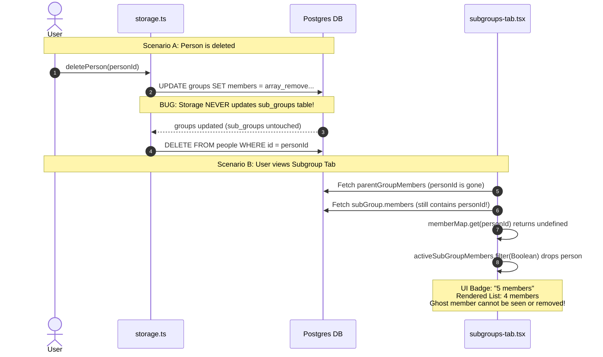

# Technical Audit: Groups, Subgroups, and Membership Architecture

**Target Systems**: Groups, Subgroups, Membership Synchronization, Smart Clustering, Crowd Computation  
**Auditor**: Senior Full-Stack & Database Architect  
**Scope**:
- Client: [`groups-list.tsx`](file:///c:/Repos/PRM/client/src/pages/groups-list.tsx), [`group-profile.tsx`](file:///c:/Repos/PRM/client/src/pages/group-profile.tsx), [`subgroup-profile.tsx`](file:///c:/Repos/PRM/client/src/pages/subgroup-profile.tsx), [`potential-groups.tsx`](file:///c:/Repos/PRM/client/src/pages/potential-groups.tsx), [`group-dialog.tsx`](file:///c:/Repos/PRM/client/src/components/group-dialog.tsx), [`subgroup-dialog.tsx`](file:///c:/Repos/PRM/client/src/components/subgroup-dialog.tsx), [`subgroups-tab.tsx`](file:///c:/Repos/PRM/client/src/components/subgroups-tab.tsx), [`members-tab.tsx`](file:///c:/Repos/PRM/client/src/components/members-tab.tsx), [`crowd-tab.tsx`](file:///c:/Repos/PRM/client/src/components/crowd-tab.tsx)
- Server: [`people-groups.ts`](file:///c:/Repos/PRM/server/routes/people-groups.ts), [`storage.ts`](file:///c:/Repos/PRM/server/storage.ts), [`task-worker.ts`](file:///c:/Repos/PRM/server/task-worker.ts)
- Data Model: [`schema.ts`](file:///c:/Repos/PRM/shared/schema.ts)

---

## Executive Summary

The PRM grouping system provides a rich user experience featuring hierarchical subgroups, dual-entity membership (people contacts and social accounts), automated crowd discovery via Instagram follower graphs, and an AI-driven community detection engine utilizing the Louvain modularity algorithm. 

However, beneath this rich feature set lies an **unstable data model** relying on PostgreSQL string arrays (`text[]`) rather than relational junction tables. This design choice fundamentally prevents relational referential integrity, causing **silent ghost/orphan members**, **data loss via cascading foreign-key deletion on social accounts**, **N+1 sequential database update loops**, and **massive over-fetching** where single endpoint calls trigger 5 to 7 relational queries and in-memory JavaScript slicing.

```mermaid
graph TD
    subgraph "Relational Schema Hazard"
        G[Groups Table] -->|onDelete: CASCADE| GN[Group Notes Table]
        G -->|onDelete: CASCADE| SG[Subgroups Table]
        G -->|CRITICAL HAZARD<br/>onDelete: CASCADE| SA[Social Accounts Table]
        SA -->|onDelete: CASCADE| SAP[Social Posts / Messages / Follows]
    end

    subgraph "Array-Based Membership (No FK)"
        G -.->|text[] members| P[People Table]
        SG -.->|text[] members| P
    end

    classDef danger fill:#fee2e2,stroke:#ef4444,stroke-width:2px;
    classDef warning fill:#fef3c7,stroke:#f59e0b,stroke-width:2px;
    classDef safe fill:#ecfdf5,stroke:#10b981,stroke-width:2px;

    class SA,SAP danger;
    class P,SG warning;
    class G,GN safe;
```

---

## 1. The Good: Highlights & Architectural Strengths

### 1.1 Multi-Signal Community Detection & Smart Grouping
The implementation in [`potential-groups.tsx`](file:///c:/Repos/PRM/client/src/pages/potential-groups.tsx) and [`task-worker.ts`](file:///c:/Repos/PRM/server/task-worker.ts#L3470-L3620) is exceptional in concept and execution:
- **Louvain Modularity Algorithm**: Integrates `runLouvainClustering` in a background worker task ([`task-worker.ts:L3544`](file:///c:/Repos/PRM/server/task-worker.ts#L3544)), calculating network density, internal edge counts, and cohesion scores rather than simplistic heuristic groupings.
- **Multi-Signal Edge Weighting**: Weights different social ties dynamically ([`task-worker.ts:L3491-L3531`](file:///c:/Repos/PRM/server/task-worker.ts#L3491-L3531)):
  - Partnerships: `weight = 5.0`
  - Parent-Child Lineage: `weight = 4.0` (or `3.5` in general mode)
  - Explicit Family Relationships: `weight = 3.0`
  - General Interpersonal Relationships: `weight = 2.0`
  - Co-following networks & bio keyword intersections for social accounts.
- **Seamless Cluster Promotion**: Users can inspect discovered clusters, review member previews and keyword clouds, tweak member selections, and promote them directly into actual groups via `/api/potential-groups/create` ([`people-groups.ts:L1568`](file:///c:/Repos/PRM/server/routes/people-groups.ts#L1568)).

### 1.2 Hierarchical Subgroup UI & Navigation
- **Structured Categorization**: Subgroups provide a natural 2-level hierarchy inside groups (e.g., Executive Committee inside Board, Engineering inside Startup).
- **Subgroup Color Token System**: Employs deterministic random palettes and predefined palette options ([`getRandomSubGroupColor`](file:///c:/Repos/PRM/shared/schema.ts#L24), `SUBGROUP_COLORS`).
- **Flexible Drill-Down Navigation**: [`SubGroupsTab`](file:///c:/Repos/PRM/client/src/components/subgroups-tab.tsx#L53-L195) provides both an aggregate overview with avatar stacks and a dedicated single-subgroup view with search, member filtering, and direct links to person detail pages.
- **Deep-linking & URL State**: Deep routes like `/group/:groupId/subgroup/:subGroupId` are supported, and [`subgroup-profile.tsx`](file:///c:/Repos/PRM/client/src/pages/subgroup-profile.tsx#L18-L22) safely forwards legacy direct links to the canonical nested route.

### 1.3 Bidirectional Member Management Workflows
- Member affiliation is observable and actionable from multiple viewpoints:
  - From the group: Add/remove members, assign directly to subgroups in one modal dialog ([`members-tab.tsx:L1120-L1152`](file:///c:/Repos/PRM/client/src/components/members-tab.tsx#L1120-L1152)).
  - From the subgroup: Add parent members or adjust roster ([`subgroups-tab.tsx:L137-L162`](file:///c:/Repos/PRM/client/src/components/subgroups-tab.tsx#L137-L162)).
  - From the person: View all subgroup affiliations via `GET /api/people/:id/subgroups` ([`people-groups.ts:L1220`](file:///c:/Repos/PRM/server/routes/people-groups.ts#L1220)).
  - Graph visualization integration: Jump directly to the 3D social graph with the current group highlighted ([`group-profile.tsx:L181`](file:///c:/Repos/PRM/client/src/pages/group-profile.tsx#L181)).

---

## 2. The Bad: Performance Bottlenecks & Client Flaws

### 2.1 Heavy Queries & Endpoint Abuse via `getGroupById`
[`storage.getGroupById`](file:///c:/Repos/PRM/server/storage.ts#L2620-L2663) is designed as a heavy "everything-at-once" aggregation query:

```typescript
// server/storage.ts:L2628-L2652
const [groupNotesList, memberDetails, groupInteractions, groupSubGroups, groupSocialAccounts] = await Promise.all([
  db.select().from(groupNotes).where(eq(groupNotes.groupId, id)),
  group.members && group.members.length > 0
    ? db.select().from(people).where(and(inArray(people.id, group.members), visibleShared(...)))
    : Promise.resolve([]),
  db.select().from(interactions).where(and(arrayContains(interactions.groupIds, [id]), visibleShared(...))),
  db.select().from(subGroups).where(eq(subGroups.groupId, id)),
  this.getSocialAccountsByGroup(id),
]);
```

While acceptable for the initial render of [`group-profile.tsx`](file:///c:/Repos/PRM/client/src/pages/group-profile.tsx), the server routes reuse this method as a generic validation or data fetcher for unrelated, lightweight endpoints:

| Endpoint | File & Line | What It Actually Needs | What It Overfetches |
| :--- | :--- | :--- | :--- |
| `GET /api/group-notes/:groupId` | [`people-groups.ts:L1238`](file:///c:/Repos/PRM/server/routes/people-groups.ts#L1238) | Notes only | Fetches all member profiles, interactions, subgroups, and social accounts, only to discard them and sort notes in Node.js memory! |
| `GET /api/groups/:id/social-accounts` | [`people-groups.ts:L1079`](file:///c:/Repos/PRM/server/routes/people-groups.ts#L1079) | Social accounts only | Calls `getGroupById(id)` (which already fetches social accounts), then calls `getSocialAccountsByGroup(id)` a second time! |
| `GET /api/groups/:id/subgroups` | [`people-groups.ts:L1151`](file:///c:/Repos/PRM/server/routes/people-groups.ts#L1151) | Subgroups only | Calls `getGroupById(id)` which executes 5 queries, then queries `subGroups` a second time ([`storage.ts:L2711`](file:///c:/Repos/PRM/server/storage.ts#L2711)). |
| `POST /api/groups/:id/subgroups` | [`people-groups.ts:L1162`](file:///c:/Repos/PRM/server/routes/people-groups.ts#L1162) | Group existence check | Executes all 5 queries just to check `if (!parentGroup)`. |
| `POST /api/groups/:id/calculate-crowd` | [`people-groups.ts:L1343`](file:///c:/Repos/PRM/server/routes/people-groups.ts#L1343) | `centerAccountId` check | Executes all 5 queries to read a single column. |
| `GET /api/groups/:id/crowd` | [`people-groups.ts:L1369`](file:///c:/Repos/PRM/server/routes/people-groups.ts#L1369) | `crowdMembers` & `centerAccountId` | Executes all 5 queries before processing crowd membership. |

### 2.2 Client-Side Bloat: `members-tab.tsx` (53KB, 1,182 Lines)
[`client/src/components/members-tab.tsx`](file:///c:/Repos/PRM/client/src/components/members-tab.tsx) has accumulated excessive responsibilities:
1. **Unconditional Global Query**:
   ```typescript
   // members-tab.tsx:L66-L68
   const { data: allPeople = [] } = useQuery<Person[]>({
     queryKey: ["/api/people"],
   });
   ```
   Opening the Members tab of any group immediately downloads the **entire people table** for all contacts in the database, even if the user never opens the "Add Members" dialog. For accounts with thousands of contacts, this creates substantial bandwidth consumption and memory strain.
2. **Client-Side Heavy Sorting & Filtering**:
   Lines [144-193](file:///c:/Repos/PRM/client/src/components/members-tab.tsx#L144-L193) implement custom sorting logic across 8 columns (`name`, `title_company`, `tags`, `subgroups`, `starred`, `phone`, `email`, `social`) combined with subgroup filtering. Every keystroke and click triggers array allocations and locale comparisons on the main thread.
3. **Monolithic Component Mixing**:
   Contains table views, list views, sort headers, star mutation handlers, dropdown menus, context menus, `AddMembersDialog`, and bindings to `PersonDialog`.

### 2.3 Redundant State Synchronization & Cache Mismatches
1. **Render-Time State Side Effects in `CrowdTab`**:
   In [`crowd-tab.tsx:L112-L127`](file:///c:/Repos/PRM/client/src/components/crowd-tab.tsx#L112-L127), query invalidation and `setCurrentTaskId(null)` are invoked **directly inside the render body**:
   ```typescript
   // crowd-tab.tsx:L112-L116
   if (taskStatus?.status === "completed" && currentTaskId) {
     setCurrentTaskId(null); // Side-effect during render!
     queryClient.invalidateQueries({ queryKey: [`/api/groups/${groupId}`] });
     queryClient.invalidateQueries({ queryKey: ["/api/groups", groupId, "crowd"] });
   ```
   Calling `setState` during render triggers React warnings and can produce infinite re-render cycles. This logic belongs inside a `useEffect`.
2. **Broken Query Key Invalidation**:
   Notice the query key in line 114 above: ``[`/api/groups/${groupId}`]`` (array with 1 formatted string).  
   However, [`group-profile.tsx:L45`](file:///c:/Repos/PRM/client/src/pages/group-profile.tsx#L45) queries with: `queryKey: ["/api/groups", groupId]` (array with 2 separate strings).  
   Because TanStack Query performs exact key matching on array elements, **the group profile query is never invalidated**! The group's `crowdLastCalculatedAt` and cached member count remain stale until a full browser reload.
3. **Local Duplicate State for Starred Status**:
   [`members-tab.tsx:L46`](file:///c:/Repos/PRM/client/src/components/members-tab.tsx#L46) maintains `const [starredStates, setStarredStates] = useState<Record<string, number>>({})` alongside React Query cache, creating synchronization drift if another component or user updates the person's starred state.

---

## 3. The Ugly: Structural Risks, Cascades & Integrity Bugs

### 3.1 CATASTROPHIC: Group Deletion Cascade Purges Social Accounts
In [`shared/schema.ts:L386`](file:///c:/Repos/PRM/shared/schema.ts#L386):

```typescript
// shared/schema.ts:L386
export const socialAccounts = pgTable("social_accounts", {
  id: varchar("id").primaryKey().default(sql`gen_random_uuid()`),
  username: text("username").notNull(),
  ownerUuid: varchar("owner_uuid").references(() => people.id, { onDelete: "cascade" }),
  groupId: varchar("group_id").references((): AnyPgColumn => groups.id, { onDelete: "cascade" }),
  // ...
```

> [!CAUTION]
> ### Critical Data Loss Vulnerability
> `socialAccounts.groupId` is defined with `{ onDelete: "cascade" }`.
> If a user assigns a brand, influencer, or team Instagram account to a group, and later deletes that group via `DELETE /api/groups/:id`:
> **PostgreSQL permanently purges the `social_accounts` records from the database!**
> 
> Because `social_accounts.id` is referenced with cascades by:
> - `socialAccountPosts` (`onDelete: "cascade"`)
> - `messages` and `messageRecipients` (`onDelete: "cascade"`)
> - `socialFollows` (`onDelete: "cascade"`)
> - `conversations` and `conversationParticipants` (`onDelete: "cascade"`)
> 
> Deleting a group irreversibly destroys the entire social identity, scrape history, follow network, and message archives!
> 
> Furthermore, the delete confirmation dialog in [`groups-list.tsx:L312`](file:///c:/Repos/PRM/client/src/pages/groups-list.tsx#L312) only tells the user:
> *"Are you sure you want to delete '{name}'? This will permanently remove this group and all associated notes."*
> The user is never warned that their social account data will be wiped out.

**Remediation**: Change `socialAccounts.groupId` foreign key to `{ onDelete: "set null" }`.

---

### 3.2 Ghost & Orphan Members in Subgroups
Because members are stored as raw PostgreSQL string arrays (`text[]`) rather than a foreign-keyed junction table, database-level referential integrity is completely absent. The codebase attempts manual synchronization in JavaScript, but suffers from severe omissions:



1. **`deletePerson` Ignores Subgroups**:
   In [`storage.ts:L1233-L1242`](file:///c:/Repos/PRM/server/storage.ts#L1233-L1242), `deletePerson(id)` iterates over `groups` to strip the deleted person ID. **It never updates `sub_groups`!** The person ID remains forever inside `sub_groups.members`.
2. **`deletePeopleCreatedSince` Ignores Subgroups & Crowd**:
   In [`storage.ts:L1273-L1282`](file:///c:/Repos/PRM/server/storage.ts#L1273-L1282), bulk cleanup strips IDs from `groups.members`, but ignores `sub_groups.members` and `groups.crowdMembers`.
3. **Parent Group Member Removal Leaks Subgroup Membership**:
   When a user clicks "Remove Member" in [`members-tab.tsx:L73-L79`](file:///c:/Repos/PRM/client/src/components/members-tab.tsx#L73-L79), it sends `PATCH /api/groups/:id` with the filtered members. **It does not remove the member from the group's child subgroups.**
4. **The Ghost Member UI Glitch**:
   In [`subgroups-tab.tsx:L165-L177`](file:///c:/Repos/PRM/client/src/components/subgroups-tab.tsx#L165-L177):
   ```typescript
   const memberMap = useMemo(() => {
     const map = new Map<string, Person>();
     parentGroupMembers.forEach((p) => map.set(p.id, p));
     return map;
   }, [parentGroupMembers]);

   const activeSubGroupMembers = useMemo(() => {
     if (!activeSubGroup) return [];
     return (activeSubGroup.members || [])
       .map((id) => memberMap.get(id))
       .filter(Boolean) as Person[];
   }, [activeSubGroup, memberMap]);
   ```
   The badge displays `activeSubGroup.members.length` (e.g. 5 members). But because the orphan ID is missing from `parentGroupMembers`, `memberMap.get(id)` returns `undefined` and `.filter(Boolean)` drops it. The rendered list shows only 4 cards with no explanation, and the user has no way to remove the phantom ID from the subgroup.

---

### 3.3 Asymmetric 1:N vs N:M Identity Trap
The schema exhibits an architectural contradiction in how entities join groups:
- **People**: Modeled as N:M via string arrays. A Person can belong to unlimited groups.
- **Social Accounts**: Modeled as 1:N via `socialAccounts.groupId`. A social account can belong to **at most ONE group**.

When promoting discovered social account clusters in [`people-groups.ts:L1604`](file:///c:/Repos/PRM/server/routes/people-groups.ts#L1604):
```typescript
if (isSocial && members && members.length > 0) {
  await db
    .update(socialAccounts)
    .set({ groupId: group.id })
    .where(inArray(socialAccounts.id, members));
}
```
If an account was already linked to "Marketing Group", promoting a new community cluster "Tech Founders" **silently reassigns** `groupId`, stealing the account from "Marketing Group" without warning or audit trace.

---

### 3.4 In-Memory N+1 Update Cascades
When deleting people or groups, the storage layer relies on unindexed sequential loops rather than set-based SQL operations:

1. **Looping updates in `deletePerson`**:
   ```typescript
   // storage.ts:L1233-L1242
   const allGroups = await db.select().from(groups); // Loads entire groups table into RAM
   for (const group of allGroups) {
     if (group.members && group.members.includes(id)) {
       const updatedMembers = group.members.filter((memberId) => memberId !== id);
       await db.update(groups).set({ members: updatedMembers }).where(eq(groups.id, group.id));
     }
   }
   ```
   If there are 500 groups, this fetches 500 rows into Node.js memory and executes sequential single-row `UPDATE` statements one after another over the network.
2. **Looping updates in `removeGroupFromInteractions`**:
   ```typescript
   // storage.ts:L1397-L1412
   for (const interaction of affectedInteractions) {
     const updatedGroupIds = (interaction.groupIds || []).filter((id) => id !== groupId);
     await db.update(interactions).set({ groupIds: updatedGroupIds }).where(eq(interactions.id, interaction.id));
   }
   ```
   Both operations could be executed in a single atomic SQL statement using PostgreSQL's native `array_remove`:
   ```sql
   UPDATE groups SET members = array_remove(members, $1) WHERE $1 = ANY(members);
   ```

---

## 4. Comprehensive Findings Matrix

| Ref | Category | Severity | Location | Impact Summary |
| :--- | :--- | :--- | :--- | :--- |
| **G-01** | Feature | Good | [`task-worker.ts:L3470`](file:///c:/Repos/PRM/server/task-worker.ts#L3470) | Louvain clustering algorithm enables high-quality automated community discovery. |
| **G-02** | Feature | Good | [`subgroups-tab.tsx:L195`](file:///c:/Repos/PRM/client/src/components/subgroups-tab.tsx#L195) | Hierarchical subgroup UI with dual overview/drilldown views and palette tokens. |
| **B-01** | Perf | Bad | [`storage.ts:L2620`](file:///c:/Repos/PRM/server/storage.ts#L2620) | `getGroupById` runs 5 queries simultaneously, over-fetching data for 6 different API endpoints. |
| **B-02** | Perf | Bad | [`members-tab.tsx:L66`](file:///c:/Repos/PRM/client/src/components/members-tab.tsx#L66) | MembersTab unconditionally downloads all people in the database on tab mount. |
| **B-03** | Code Smell | Bad | [`members-tab.tsx:L1`](file:///c:/Repos/PRM/client/src/components/members-tab.tsx#L1) | 53KB monolithic component mixing sorting, filtering, context menus, and modals. |
| **B-04** | State/Bug | Bad | [`crowd-tab.tsx:L112`](file:///c:/Repos/PRM/client/src/components/crowd-tab.tsx#L112) | Side-effect `setState` in render body; query key mismatch breaks React Query cache invalidation. |
| **U-01** | Data Loss | **Ugly** | [`schema.ts:L386`](file:///c:/Repos/PRM/shared/schema.ts#L386) | `socialAccounts.groupId` has `onDelete: cascade`. Deleting a group purges social accounts and scrape history. |
| **U-02** | Integrity | **Ugly** | [`storage.ts:L1228`](file:///c:/Repos/PRM/server/storage.ts#L1228) | `deletePerson` does not clean `sub_groups.members`, causing permanent ghost members in subgroups. |
| **U-03** | Integrity | **Ugly** | [`members-tab.tsx:L73`](file:///c:/Repos/PRM/client/src/components/members-tab.tsx#L73) | Removing a member from a group leaves them stranded in child subgroups. |
| **U-04** | Data Model | **Ugly** | [`schema.ts:L386`](file:///c:/Repos/PRM/shared/schema.ts#L386) | Asymmetric 1:N FK for social accounts causes silent reassignment when promoting potential groups. |
| **U-05** | Perf | **Ugly** | [`storage.ts:L1233`](file:///c:/Repos/PRM/server/storage.ts#L1233) | In-memory loop over all groups and sequential updates during person deletion. |

---

## 5. Actionable Remediation Plan

### Step 1: Emergency Data Safety Fix (Immediate)
Change the foreign key deletion rule on `social_accounts.groupId` in [`shared/schema.ts:L386`](file:///c:/Repos/PRM/shared/schema.ts#L386):
```diff
- groupId: varchar("group_id").references((): AnyPgColumn => groups.id, { onDelete: "cascade" }),
+ groupId: varchar("group_id").references((): AnyPgColumn => groups.id, { onDelete: "set null" }),
```

### Step 2: Atomic Cleanup for Person Deletion (Immediate)
Replace the in-memory JavaScript loops in `deletePerson` and `removeGroupFromInteractions` with single atomic SQL queries:
```typescript
// server/storage.ts
await db.execute(sql`UPDATE groups SET members = array_remove(members, ${id}) WHERE ${id} = ANY(members)`);
await db.execute(sql`UPDATE sub_groups SET members = array_remove(members, ${id}) WHERE ${id} = ANY(members)`);
await db.execute(sql`UPDATE groups SET crowd_members = array_remove(crowd_members, ${id}) WHERE ${id} = ANY(crowd_members)`);
await db.execute(sql`UPDATE interactions SET group_ids = array_remove(group_ids, ${groupId}) WHERE ${groupId} = ANY(group_ids)`);
```

### Step 3: Cascading Member Removal in Subgroups
Update the group member update logic so that removing a member from `groups.members` also strips them from all child `sub_groups.members`:
```typescript
// When updating group members:
const removedMemberIds = oldMembers.filter(m => !newMembers.includes(m));
if (removedMemberIds.length > 0) {
  for (const mId of removedMemberIds) {
    await db.execute(
      sql`UPDATE sub_groups SET members = array_remove(members, ${mId}) WHERE group_id = ${groupId}`
    );
  }
}
```

### Step 4: Fix Cache Invalidation & Lifecycle in `CrowdTab`
1. Move task completion side effects into `useEffect` in [`crowd-tab.tsx`](file:///c:/Repos/PRM/client/src/components/crowd-tab.tsx).
2. Align the query key with `GroupProfile`:
```diff
- queryClient.invalidateQueries({ queryKey: [`/api/groups/${groupId}`] });
+ queryClient.invalidateQueries({ queryKey: ["/api/groups", groupId] });
```

### Step 5: Decompose `members-tab.tsx` & Paginate Add Dialog
1. Only query `/api/people` when the "Add Members" dialog is open (`enabled: isAddMemberOpen`).
2. Split [`members-tab.tsx`](file:///c:/Repos/PRM/client/src/components/members-tab.tsx) into:
   - `components/groups/members-table-view.tsx`
   - `components/groups/members-list-view.tsx`
   - `components/groups/add-members-dialog.tsx`

### Step 6: Long-term Architectural Migration (Relational Junctions)
Transition from `text[]` arrays to proper junction tables:
- `group_members (group_id, person_id, role, added_at, PRIMARY KEY (group_id, person_id))`
- `subgroup_members (subgroup_id, person_id, PRIMARY KEY (subgroup_id, person_id))`
- `group_social_accounts (group_id, social_account_id, PRIMARY KEY (group_id, social_account_id))`

This ensures database-enforced cascading deletes, prevents ghost members permanently, allows social accounts to join multiple groups, and eliminates full-table scans.
