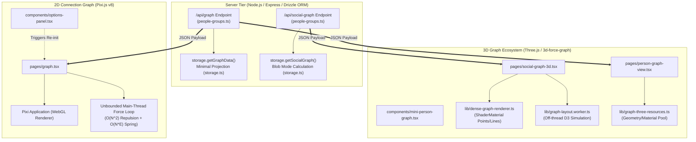

# Technical Audit: Graph Visualization Subsystem

**Auditor:** Graphics, Visualization, and WebGL Systems Specialist  
**Target Repository:** `PRM (Personal Relationship Manager)`  
**Scope:** 2D Pixi.js Graph Engine, 3D Force-Graph & Dense WebGL Subsystems, Backend Graph API & Blob Clustering  
**Target File:** `c:\Repos\PRM\good-bad-ugly\06-graph-visualization.md`  

---

## Executive Summary

The PRM graph visualization subsystem provides visual relationship mapping across people, social accounts, groups, and family lineages. It employs a multi-engine architecture spanning a 2D hardware-accelerated canvas via **Pixi.js v8** ([`graph.tsx`](file:///c:/Repos/PRM/client/src/pages/graph.tsx)), a 3D orbit simulation via **Three.js** and **3d-force-graph** ([`person-graph-view.tsx`](file:///c:/Repos/PRM/client/src/pages/person-graph-view.tsx) and [`social-graph-3d.tsx`](file:///c:/Repos/PRM/client/src/pages/social-graph-3d.tsx)), an embedded profile inspector ([`mini-person-graph.tsx`](file:///c:/Repos/PRM/client/src/components/mini-person-graph.tsx)), and a specialized batched point/line shader pipeline ([`dense-graph-renderer.ts`](file:///c:/Repos/PRM/client/src/lib/dense-graph-renderer.ts)).

While the subsystem demonstrates sophisticated visualization concepts—such as the algorithmic leaf-absorption in **Blob Mode** and GPU-accelerated batch rendering—it suffers from severe architectural disconnects between WebGL lifecycles and React DOM lifecycles. Crucially, the 2D Pixi.js implementation contains un-throttled $O(N^2)$ force simulation loops that run indefinitely on the main thread, lacks mobile gesture/canvas panning capabilities, recreates entire WebGL rendering contexts upon minor state filter changes, and exposes the application to silent crashes through unhandled WebGL context loss. Furthermore, dual-bundling both Pixi.js v8 and Three.js imposes heavy bundle bloat, while un-cached server-side blob calculations on raw PostgreSQL tables threaten Node.js event loop starvation.

---

## Architectural Map of the Subsystem



---

## 1. The Good: Architectural Highlights

### 1.1 WebGL-Based Hardware Acceleration via Pixi.js v8
In [`client/src/pages/graph.tsx`](file:///c:/Repos/PRM/client/src/pages/graph.tsx#L220-L230), the 2D connection graph leverages Pixi.js v8 with hardware-accelerated WebGL preference (`preference: 'webgl'`, `autoDensity: true`, `resolution: window.devicePixelRatio || 1`). Rather than relying on DOM elements or CPU-bound HTML5 2D Canvas rendering, node rendering and edge draws benefit from GPU batching and fast matrix transforms. Interactive picking is handled via Pixi's modern event system (`eventMode = 'static'`, lines 267, 358, 703), decoupling mouse/pointer raycasting from manual canvas coordinate intersection math.

### 1.2 Dedicated, Minimally Projected Backend Graph Endpoint
The dedicated endpoint `GET /api/graph` registered in [`server/routes/people-groups.ts`](file:///c:/Repos/PRM/server/routes/people-groups.ts#L97-L105) delegates directly to [`storage.getGraphData()`](file:///c:/Repos/PRM/server/storage.ts#L681-L775). Unlike general CRUD endpoints that serialize bulky JSON models, this endpoint executes selective parallel queries via `Promise.all`:
- Selects only `id`, `firstName`, `lastName`, `company`, `imageUrl`, and `socialAccountUuids` from the `people` table.
- Joins `relationships` with `relationshipTypes` strictly for edge source/target IDs and `typeColor`.
- Fetches `groups`, `lineage`, and `partnerships` in the same parallel round-trip.
- Synthesizes familial lineage (parent $\rightarrow$ child) and partnership relationships into unified family edge vectors (`typeColor: "#ef4444"`).

This lean projection avoids over-fetching heavy biographical metadata, rich text notes, and vector embeddings over the wire.

### 1.3 Blob Mode Algorithmic Merging
The blob mode calculation in [`server/storage.ts`](file:///c:/Repos/PRM/server/storage.ts#L3052-L3108) implements an intelligent graph topological reduction algorithm:
1. **Degree Indexing:** Accumulates node link degrees across all edges via a fast integer hash map (`nodeLinkCount`).
2. **Leaf Node Detection:** Isolates single-connection nodes (`(nodeLinkCount.get(n.id) || 0) === 1`).
3. **Hub Absorption:** Maps each single-connection leaf to its neighboring hub node, ensuring the hub has degree $> 1$.
4. **Mass Transfer:** Merges leaf node mass into the hub:
   ```typescript
   absorber.size += (settings.blobMergeMultiplier ?? 0.5);
   if (!absorber.mergedNames) absorber.mergedNames = [];
   absorber.mergedNames.push(removedNode.name);
   ```
5. **Edge Pruning:** Filters absorbed nodes and their incident links, collapsing peripheral clutter into visually weighted clusters without discarding relationship context.

### 1.4 Advanced 3D Optimizations in Sister Modules
The codebase demonstrates high WebGL maturity in its 3D subsystem:
- **Shared Geometry & Material Caching:** [`GraphResourceCache`](file:///c:/Repos/PRM/client/src/lib/graph-three-resources.ts#L22-L115) eliminates per-node allocation of Three.js sphere and ring geometries, preventing GPU driver memory fragmentation.
- **Batched Dense Rendering:** [`DenseGraphRenderer`](file:///c:/Repos/PRM/client/src/lib/dense-graph-renderer.ts#L78-L150) collapses thousands of nodes and links into exactly two WebGL draw calls (`THREE.Points` and `THREE.LineSegments`) using custom GLSL shaders with billboard size scaling.
- **WebWorker Offloading:** [`graph-layout.worker.ts`](file:///c:/Repos/PRM/client/src/lib/graph-layout.worker.ts) offloads D3 force calculations completely off the browser main thread.

---

## 2. The Bad: Suboptimal Patterns & Bottlenecks

### 2.1 State Synchronization Anti-Pattern: Full Canvas Destruction on Filter Changes
In [`client/src/pages/graph.tsx`](file:///c:/Repos/PRM/client/src/pages/graph.tsx#L156-L240), the Pixi.js application initialization and rendering loop reside inside a monolithic `useEffect` hook whose dependency array (line 841) includes:
```typescript
[people, groups, navigate, showGroups, disablePersonLines, highlightedPersonId, anonymizePeople]
```

#### The Consequence:
Whenever a user toggles "Show Groups", "Disable Person Lines", "Anonymize", or selects a person in the search dropdown:
1. The hook triggers its cleanup: cancels the animation frame, destroys the Pixi `Application`, purges the DOM canvas, and clears all internal node/edge collections.
2. The hook executes `initPixi()`: asynchronously re-creates `new Application()`, calls `await app.init(...)`, rebuilds all graphics objects, and re-attaches the canvas.
3. Node coordinates are completely reset to circular distribution geometry (`lines 257-260`), causing existing node layouts to violently pop back to the origin circle and restart physics from tick 0.

#### Contrast with Physics Controls:
Force parameters (`centerForce`, `repelForce`, `linkForce`, `linkDistance`) are synchronized live via React refs (`centerForceRef.current = centerForce`, lines 107-121) without rebuilding the scene. The visual filters should follow a similar mutation pattern—updating visibility flags (`graphics.visible = false`) and filtering active physics collections in-place—rather than destroying the entire WebGL engine.

### 2.2 Unoptimized, Infinite Main-Thread Force Simulation
The 2D force simulation in [`client/src/pages/graph.tsx`](file:///c:/Repos/PRM/client/src/pages/graph.tsx#L549-L698) exhibits severe computational bottlenecks:

1. **Unbounded Render Loop:**
   There is no alpha decay, velocity threshold, or simulation cooling mechanism. Unlike D3's standard simulation which steps until $\alpha < \alpha_{min}$, [`simulate()`](file:///c:/Repos/PRM/client/src/pages/graph.tsx#L696) schedules an unconditional `requestAnimationFrame(simulate)`. Even when the graph has achieved mechanical equilibrium and velocities approach zero, the loop executes at 60Hz/120Hz indefinitely, burning CPU and battery.
2. **$O(N^2)$ Repulsion Loop on Main Thread:**
   Repulsion between nodes is computed through nested JavaScript iterations without spatial partitioning:
   ```typescript
   // client/src/pages/graph.tsx:573-584
   nodes.forEach((other) => {
     if (node.id !== other.id && other.graphics.visible) {
       const dx = node.x - other.x;
       const dy = node.y - other.y;
       const distSq = dx * dx + dy * dy + 1;
       const force = repelForceRef.current / distSq;
       fx += (dx / Math.sqrt(distSq)) * force;
       fy += (dy / Math.sqrt(distSq)) * force;
     }
   });
   ```
   At 500 nodes, this executes 250,000 force computations and square roots per frame; at 1,000 nodes, 1,000,000 iterations per frame on the main thread.
3. **Per-Frame Geometry Re-allocation for All Edges:**
   Lines 660–675 clear and redraw every line segment every frame:
   ```typescript
   const g = edge.graphics;
   g.clear();
   g.moveTo(fromNode.x, fromNode.y);
   g.lineTo(toNode.x, toNode.y);
   g.stroke({ color: edge.color, width: 2, alpha: 0.6 });
   ```
   Calling `.clear()` and re-tessellating lines every frame generates thousands of transient geometry buffers per second, inducing severe V8 Garbage Collection (GC) pauses and GPU vertex pipeline churn.

### 2.3 Flawed Mobile/Touch Interaction & Missing Pan Navigation
In [`client/src/pages/graph.tsx`](file:///c:/Repos/PRM/client/src/pages/graph.tsx#L702-L781):
- **Missing Background Pan:** While individual nodes can be dragged (`graphics.on('pointerdown')`, lines 290-311), clicking and dragging the canvas background does not translate the root `Container`. Users can zoom into a section using the mouse wheel, but cannot pan horizontally or vertically across the canvas space.
- **No Pinch-to-Zoom or Touch Gestures:** Zooming is implemented exclusively via DOM wheel listener (`app.canvas.addEventListener('wheel', handleWheel)`, line 781). On iOS/Android touchscreens, pinch gestures trigger default browser viewport zoom or do nothing, rendering the graph virtually un-navigable on mobile devices.

### 2.4 Inconsistent Styling & Dynamic Theme Decoupling
In [`client/src/pages/graph.tsx`](file:///c:/Repos/PRM/client/src/pages/graph.tsx#L208-L216):
- Theme CSS variables (`--background` and `--foreground`) are sampled once at initialization via `getComputedStyle(document.documentElement)`.
- When a user toggles light/dark mode in the PRM application navbar (`ThemeToggle`), no mutation observer or theme context updates the Pixi canvas. The canvas background and node label text remain locked to the old theme until a hard re-render occurs.
- Node fills rely on hardcoded literal hex numbers (`0x6366f1` Indigo, `0x818cf8`, `0x8b5cf6`, lines 263, 323, 353) instead of dynamically binding to PRM's HSL design token palette.

---

## 3. The Ugly: Critical Vulnerabilities, Leaks, & Scalability Hazards

### 3.1 Unhandled WebGL Context Loss
Browsers enforce strict constraints on active WebGL contexts (typically 8 to 16 concurrent contexts across all tabs). When GPU resources become saturated, a tab moves to the background, or an OS graphics driver resets, the browser emits a `webglcontextlost` event.

#### The Hazard:
A codebase-wide search confirms **zero occurrences of `webglcontextlost` or `webglcontextrestored` listeners** across the PRM client.
When context loss occurs in [`graph.tsx`](file:///c:/Repos/PRM/client/src/pages/graph.tsx), Pixi.js halts rendering. Because there is no context restoration listener, the canvas becomes permanently black or transparent. Any subsequent internal API call on destroyed WebGL resources throws uncaught runtime errors into the animation loop.

### 3.2 Async Race Conditions & Memory Leaks on Rapid Navigation
The initialization routine in [`graph.tsx`](file:///c:/Repos/PRM/client/src/pages/graph.tsx#L171-L240) is asynchronous:
```typescript
const initPixi = async () => {
  // ...
  const app = new Application();
  await app.init({ ... });
  
  if (!active) {
    app.destroy();
    return;
  }
  if (canvasRef.current) canvasRef.current.appendChild(app.canvas);
  appRef.current = app;
  // ...
};
```

#### The Race Vulnerability:
1. When a user navigates between routes or toggles options quickly, the cleanup function runs while `await app.init(...)` is in flight.
2. At the moment of unmount, `appRef.current` is still `null` (or points to the *previous* app), so the cleanup handler:
   ```typescript
   if (appRef.current) {
     appRef.current.destroy(true, { children: true, texture: true });
     appRef.current = null;
   }
   ```
   cannot destroy the pending `Application`.
3. When the promise resolves, line 232 checks `if (!active) { app.destroy(); return; }`. However, calling `app.destroy()` on Pixi v8 without full child/texture teardown options (`{ children: true, texture: true }`) leaves GPU textures, shader programs, and canvas backing stores uncollected.
4. If `active` was not flipped in time due to overlapping React 18 concurrent renders, two distinct `Application` instances end up attached to or rendering within the same DOM node.

### 3.3 Severe Bundle Size Bloat: Dual WebGL Engine Coexistence
Inspection of [`package.json`](file:///c:/Repos/PRM/package.json#L40-L75) reveals simultaneous inclusion of competing, heavyweight 3D/2D WebGL libraries:
- `"pixi.js": "^8.14.0"` (~500 KB+ minified/gzipped)
- `"three": "^0.185.1"` (~600 KB+ minified/gzipped)
- `"3d-force-graph": "^1.79.0"` (bundles Three.js subcomponents and d3-force-3d)
- `"@xyflow/react": "^12.11.0"` (separate flow diagramming engine)

#### Architectural Duplication:
PRM maintains **two completely different WebGL graphics stacks** for relationship graphs:
- 2D connection graph in [`client/src/pages/graph.tsx`](file:///c:/Repos/PRM/client/src/pages/graph.tsx) uses Pixi.js v8.
- 3D connection graph in [`client/src/pages/person-graph-view.tsx`](file:///c:/Repos/PRM/client/src/pages/person-graph-view.tsx) and [`social-graph-3d.tsx`](file:///c:/Repos/PRM/client/src/pages/social-graph-3d.tsx) uses Three.js.
- Embedded profile widget in [`client/src/components/mini-person-graph.tsx`](file:///c:/Repos/PRM/client/src/components/mini-person-graph.tsx) boots an entire Three.js WebGL context inside a 320px widget.

Neither engine is configured with rollup vendor code-splitting in [`vite.config.ts`](file:///c:/Repos/PRM/vite.config.ts). When visiting the graph feature, client devices must parse and compile multiple megabytes of redundant WebGL abstraction code.

### 3.4 Server-Side CPU Spikes & Event Loop Starvation on Large Blob Calculations
While the blob mode endpoint in [`server/routes/people-groups.ts`](file:///c:/Repos/PRM/server/routes/people-groups.ts#L1296-L1337) and [`server/storage.ts`](file:///c:/Repos/PRM/server/storage.ts#L2797-L3111) is functionally elegant, its backend implementation is a major production hazard:

1. **Unindexed Full Table Scans into Node Memory:**
   [`storage.getSocialGraph()`](file:///c:/Repos/PRM/server/storage.ts#L2798-L2802) loads all accounts, account types, and follow records into raw JavaScript memory:
   ```typescript
   const [allAccounts, allTypes, allFollows] = await Promise.all([
     db.select().from(socialAccounts),
     db.select().from(socialAccountTypes),
     db.select().from(socialFollows),
   ]);
   ```
   If a social network import contains 50,000 follow edges, the server loads 50,000 Drizzle ORM rows into the Node.js V8 heap per request.
2. **Synchronous JavaScript Graph Traversal:**
   Lines 2824–3000 build deep bidirectional relationship sets (`directConnectionsMap`), filter arrays iteratively (`filtered.find`), and traverse link sets synchronously.
3. **Zero Caching:**
   The endpoint `POST /api/social-graph` has **no Redis, LRU memory, or HTTP caching headers**. Every time a user drags the "Blob Merge Multiplier" slider or adjusts "Max Extras", the client issues POST requests that re-query the full database tables and re-execute the synchronous blob merging algorithm.
4. **Node.js Event Loop Blocking:**
   Because Node.js executes JavaScript on a single thread, synchronous iteration over tens of thousands of graph edges blocks the event loop. During graph calculation, all concurrent API requests (authentication, database queries, WebSocket messages) are queued, leading to latency spikes and gateway timeouts (HTTP 504) for all connected users.

---

## 4. Comprehensive Comparison Matrix

| Architectural Dimension | 2D Graph (`graph.tsx`) | 3D Graph (`person-graph-view.tsx` / `social-graph-3d.tsx`) | Mini Graph (`mini-person-graph.tsx`) |
| :--- | :--- | :--- | :--- |
| **Rendering Engine** | Pixi.js v8 WebGL | Three.js / 3d-force-graph | Three.js / 3d-force-graph |
| **Simulation Location** | Main Thread (JS loop) | Main Thread or WebWorker (`graph-layout.worker.ts`) | Main Thread (d3-force-3d) |
| **Algorithm Complexity** | $O(N^2)$ Repulsion + $O(N \cdot E)$ | Barnes-Hut quad/octree via d3-force-3d | Small subset $O(N)$ direct edges |
| **Simulation Halting** | **Never stops** (infinite 60Hz loop) | Stops via `d3AlphaDecay` & `cooldownTime` | Stops via `d3AlphaDecay` & `cooldownTime` |
| **Edge Rendering** | Re-clears and re-strokes every frame | WebGL Line / Shader batching | Three.js Line segments |
| **Resize Handling** | **None** (canvas fixed at init dimensions) | Window / Container resize listeners | `ResizeObserver` on element container |
| **Touch / Mobile Gestures** | **None** (wheel listener only) | Full Touch Orbit / Pinch zoom | Full Touch Orbit / Pinch zoom |
| **State Sync on Filter** | **Destroys and recreates WebGL App** | Re-applies data via `graphData(gData)` | Re-applies data via `graphData(...)` |
| **Resource Pooling** | **None** (new Graphics/Text per node) | `GraphResourceCache` (shared sphere/ring) | Single shared material |
| **Context Loss Handler** | Missing | Missing | Missing |

---

## 5. Remediation Roadmap & Recommended Refactoring

### Phase 1: Immediate Stability Fixes (2D Pixi.js Engine)
1. **Simulation Convergence (Alpha Cooling):**
   Implement velocity and energy dampening with an automatic stop threshold:
   ```typescript
   // In simulate():
   let maxVelocity = 0;
   nodes.forEach(node => {
     maxVelocity = Math.max(maxVelocity, Math.abs(node.vx), Math.abs(node.vy));
   });
   if (maxVelocity < 0.05) {
     // Settle simulation and suspend requestAnimationFrame
     return;
   }
   animationRef.current = requestAnimationFrame(simulate);
   ```
2. **Decouple Filter State from WebGL Application Lifecycle:**
   Remove `showGroups`, `disablePersonLines`, `highlightedPersonId`, and `anonymizePeople` from the `useEffect` initialization dependency array. Maintain persistent node graphics and toggle visibility via `node.graphics.visible = false` and `node.text.visible = false`.
3. **Add `ResizeObserver`:**
   Attach a `ResizeObserver` to `canvasRef.current` to invoke `app.renderer.resize(width, height)` whenever sidebars collapse or window dimensions change.
4. **Implement WebGL Context Loss Recovery:**
   ```typescript
   app.canvas.addEventListener('webglcontextlost', (event) => {
     event.preventDefault();
     cancelAnimationFrame(animationRef.current);
     console.warn('WebGL context lost. Pausing renderer.');
   }, false);
   app.canvas.addEventListener('webglcontextrestored', () => {
     initPixi();
   }, false);
   ```

### Phase 2: Engine Consolidation & Bundle Optimization
1. **Unify Under a Single Graphics Stack:**
   Retire Pixi.js v8 in favor of Three.js (which is already bundled and optimized via [`dense-graph-renderer.ts`](file:///c:/Repos/PRM/client/src/lib/dense-graph-renderer.ts)). An orthographic 2D camera view in Three.js can replace `graph.tsx` with zero visual degradation while cutting ~500 KB from the vendor chunk.
2. **Vite Chunk Splitting:**
   Configure explicit Rollup chunk splitting in [`vite.config.ts`](file:///c:/Repos/PRM/vite.config.ts):
   ```typescript
   build: {
     rollupOptions: {
       output: {
         manualChunks: {
           three: ['three', '3d-force-graph', 'd3-force-3d'],
           pixi: ['pixi.js'],
         },
       },
     },
   }
   ```

### Phase 3: Server-Side Scalability & Blob Caching
1. **Database-Level Aggregation:**
   Replace the in-memory loading of all `socialFollows` with SQL aggregations (`GROUP BY follower_id`, `COUNT(*)`) and CTE-based degree calculations.
2. **In-Memory Cache (LRU or Redis):**
   Wrap `storage.getSocialGraph(settings)` with an in-memory cache keyed by `hash(settings, last_db_update_timestamp)`. Graph layout computations should return cached JSON payloads instantly when adjusting visual-only parameters.
3. **Worker Thread Offloading for Blob Math:**
   For graphs exceeding 5,000 nodes, offload leaf-absorption calculations to a Node.js `worker_threads` pool to prevent event loop blocking.
