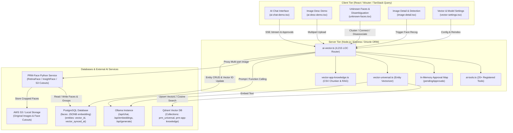

# Technical Audit: AI Assistant, Vector Search, and Face Recognition Subsystems

**Auditor:** AI, Vector Database, and Computer Vision Systems Specialist  
**Target Repository:** `PRM (Personal Relationship Manager)`  
**Scope:** Universal Vector Architecture, Ollama Integration, AI Tools & Agentic Chat, PRM-Face Microservice, Facial Clustering & Identity Linking  
**Target File:** `c:\Repos\PRM\good-bad-ugly\07-ai-vector-face-recognition.md`  

---

## Executive Summary

The PRM application incorporates a multi-tiered artificial intelligence and computer vision stack designed to turn an unstructured personal contact ledger into a context-aware relationship intelligence platform. The subsystem encompasses three primary components:
1. **Vector Search & Semantic Retrieval:** A dual-engine RAG architecture combining an external **Qdrant** vector database ([`server/vector.ts`](file:///c:/Repos/PRM/server/vector.ts), [`server/vector-universal.ts`](file:///c:/Repos/PRM/server/vector-universal.ts), and [`server/vector-app-knowledge.ts`](file:///c:/Repos/PRM/server/vector-app-knowledge.ts)) with local **Ollama** embeddings across nine core business entity types.
2. **AI Assistant & Agentic Tool Execution:** An Ollama-powered conversational chat engine ([`server/routes/ai-vector.ts`](file:///c:/Repos/PRM/server/routes/ai-vector.ts) and [`server/ai-tools.ts`](file:///c:/Repos/PRM/server/ai-tools.ts)) featuring 20+ specialized function-calling tools, configurable authorization gating (`off`, `auth`, `open`), and an SSE-driven ThoughtChain visualization interface ([`client/src/pages/ai-chat-demo.tsx`](file:///c:/Repos/PRM/client/src/pages/ai-chat-demo.tsx)).
3. **Face Recognition & Image Intelligence:** An asynchronous computer vision pipeline integrated with an external Python microservice (**PRM-Face**), featuring face detection, S3 cutout generation, vector clustering via `personface_uuid`, and interactive identity disambiguation ([`client/src/pages/unknown-faces.tsx`](file:///c:/Repos/PRM/client/src/pages/unknown-faces.tsx) and [`client/src/pages/image-detail.tsx`](file:///c:/Repos/PRM/client/src/pages/image-detail.tsx)).

While the subsystem demonstrates commendable architectural ambition—notably in its multi-entity universal vectorization and human-in-the-loop tool approval workflows—it is severely undermined by critical database anti-patterns, main-thread event loop blocking, memory bloat, and fragile error management:
- **Database & Indexing Crisis:** Face recognition embeddings (512-dimensional floating-point vectors) are stored as raw `JSONB` arrays in PostgreSQL without `pgvector`, HNSW, or IVFFlat indexing. Every similarity search degrades into an $O(N)$ sequential table scan and in-memory Euclidean distance calculation.
- **Node.js Event Loop & Concurrency Starvation:** Synchronous file I/O (`fs.readFileSync`) is executed on the main thread during image recognition runs, background processing routes hold HTTP client sockets open synchronously for up to 30 seconds, and in-memory approval promises leak when client sockets disconnect.
- **Catastrophic Memory Overhead:** Multer buffers 50MB image uploads directly in RAM, converts them into 67MB Base64 strings, and serializes them into 70MB JSON payloads, consuming ~250MB–300MB of heap per request and exposing the single-process Node runtime to fatal V8 Out-Of-Memory crashes.
- **Brittle UX & Hallucination Hazards:** The streaming chat client discards the user's typed prompt and history upon any stream network failure, while background LLM classification jobs (e.g. sex guessing) rely on unconstrained prompts and raw regex extractions with zero confidence gating.

---

## Subsystem Architecture Map



---

## 1. The Good: Architectural Strengths & Modern Patterns

### 1.1 Universal Vector Embeddings Across Heterogeneous Entities
Rather than siloing vector search to a single entity type, PRM implements a comprehensive cross-domain semantic index in [`server/vector-universal.ts`](file:///c:/Repos/PRM/server/vector-universal.ts#L22-L31). The universal schema indexes nine distinct domain models into a unified Qdrant collection (`prm_universal`):
- `person`: Names, company, job title, tags, email, and phone.
- `group`: Group title, category tags, and dynamically resolved member names ([`lines 417-424`](file:///c:/Repos/PRM/server/vector-universal.ts#L417-L424)).
- `interaction`: Title, rich description, type classification, and resolved participant names ([`lines 438-453`](file:///c:/Repos/PRM/server/vector-universal.ts#L438-L453)).
- `social_account`: Handle, platform type, nickname, and profile bio.
- `note` & `daily_note`: Body markdown, timestamps, and structured daily journal events.
- `image`: Vision-model-generated semantic description (`imageDescription`).
- `ai_chat`: Chat title, system prompt, and truncated conversation history.
- `message`: Sender attribution, timestamp, and message body.

```typescript
// server/vector-universal.ts: Line 275
await client.upsert(cfg.universalCollection, {
  wait: true,
  points: [{
    id: pointId,
    vector,
    payload: {
      type,
      entity_id: entityId,
      user_id: data.userId || data.createdByUserId || null,
      title,
      snippet,
      created_at: data.createdAt ? new Date(data.createdAt).toISOString() : new Date().toISOString(),
      meta: data.meta || {},
    },
  }],
});
```

Crucially, [`server/vector-universal.ts`](file:///c:/Repos/PRM/server/vector-universal.ts#L200-L205) implements an intelligent guard (`isVectorizable`) for images: photos are inserted into the database before vision inference completes, so the vectorizer skips description-less images at insert time and indexes them only after AI captioning populates `imageDescription`.

### 1.2 Declarative Tool Calling & Multi-Step Agentic Loops
The AI tool infrastructure in [`server/ai-tools.ts`](file:///c:/Repos/PRM/server/ai-tools.ts) provides a centralized, type-safe registry of 20+ specialized tools categorized into 8 domains (`search`, `messages`, `people`, `interactions`, `notes`, `daily-notes`, `social-accounts`, `relationships`).
- **Standardized Function Schemas:** Each tool exports JSON Schema parameters compatible with Ollama's OpenAI-compatible function calling API ([`lines 1493-1502`](file:///c:/Repos/PRM/server/ai-tools.ts#L1493-L1502)).
- **Result Projection:** Tool handlers return trimmed, projection-limited JSON representations ([`lines 108-185`](file:///c:/Repos/PRM/server/ai-tools.ts#L108-L185)), avoiding context window saturation.
- **Autonomous Multi-Step Reasoning:** In [`server/routes/ai-vector.ts`](file:///c:/Repos/PRM/server/routes/ai-vector.ts#L1834-L2037), `runStreamingChatWithTools` implements an agentic loop allowing the LLM up to five recursive iteration steps (`MAX_ITERATIONS = 5`). If a tool call yields new leads, the intermediate tool output is appended to the message array and fed back to Ollama to synthesize multi-entity relationships.

### 1.3 Human-in-the-Loop Tool Authorization Bus
In [`server/ai-tools.ts`](file:///c:/Repos/PRM/server/ai-tools.ts#L79-L83), tools that mutate database state are explicitly flagged with `write: true` (`create_person`, `update_person`, `create_note`, `create_interaction`, `update_interaction`, `create_daily_note`, `update_daily_note`, `set_relationship`).
The execution mode configured in [`client/src/pages/intelligence-tools-settings.tsx`](file:///c:/Repos/PRM/client/src/pages/intelligence-tools-settings.tsx#L36) governs write actions:
- `off`: Write tools are completely blocked; a synthetic error is returned to the model.
- `auth`: The server pauses the streaming agent loop and emits a `tool_approval_request` SSE event to the client ([`server/routes/ai-vector.ts: Line 1970`](file:///c:/Repos/PRM/server/routes/ai-vector.ts#L1970)). The UI renders an interactive approval modal ([`client/src/components/tool-approval-popup.tsx`](file:///c:/Repos/PRM/client/src/components/tool-approval-popup.tsx)). The loop blocks asynchronously until the user explicitly accepts or rejects via `POST /api/ai-tools/approvals/:id`.
- `open`: Write operations proceed autonomously without blocking.

### 1.4 Face Identity Clustering & Microservice Decoupling
The facial recognition architecture achieves clean separation of concerns by delegating heavy machine learning inference to a dedicated Python microservice (**PRM-Face**):
- **Delayed Initialization Pattern:** Documented in [`image-pipeline-upgrade-prm-face.md`](file:///c:/Repos/PRM/image-pipeline-upgrade-prm-face.md#L9-L60), PRM-Face boots up uninitialized (`503 Service Unavailable`) until PRM conducts a setup handshake via `POST /api/get-api-key`, dynamically transmitting PostgreSQL connection strings and S3 credentials.
- **Identity Grouping via `personface_uuid`:** Faces detected across disparate photographs share an abstract clustering identifier (`personface_uuid`). In [`client/src/pages/unknown-faces.tsx`](file:///c:/Repos/PRM/client/src/pages/unknown-faces.tsx#L103-L140), users can bulk-associate an entire face cluster with an existing CRM person, link them to a social account, or disassociate a misclustered face into a new standalone identity (`POST /api/prm-face/face/disassociate`).

---

## 2. The Bad: Suboptimal Patterns & Bottlenecks

### 2.1 Sequential, Unbatched Embedding Generation
When performing bulk vectorization in [`server/vector-universal.ts`](file:///c:/Repos/PRM/server/vector-universal.ts#L547-L562) (`bulkSyncAll`) or reindexing application knowledge in [`server/vector-app-knowledge.ts`](file:///c:/Repos/PRM/server/vector-app-knowledge.ts#L64-L95), entities are processed in a strictly sequential, unbatched `for` loop:

```typescript
// server/vector-universal.ts: Lines 547-555
for (const { type, ids } of entityIds) {
  for (const id of ids) {
    const data = await loadEntityData(type, id);
    if (!data) continue;
    const text = composeTextForEntity(type, data);
    if (!text) continue;
    await upsertEntityVector(type, id, data, data.vectorId);
    processed++;
  }
}
```

This pattern introduces major latency and cost bottlenecks:
1. **Network Chatting:** For a dataset of 3,000 entities, the server makes 3,000 individual HTTP POST requests to Ollama's `/api/embeddings` endpoint. Ollama's modern `/api/embed` endpoint supports batching arrays of texts in a single forward pass over the GPU.
2. **Unbatched Qdrant Upserts:** `upsertEntityVector` ([`vector-universal.ts: Line 269`](file:///c:/Repos/PRM/server/vector-universal.ts#L269)) calls `client.upsert(..., { wait: true, points: [...] })` with an array of length 1 for every single record, incurring 3,000 individual gRPC/REST network round-trips to Qdrant.
3. **Database Write Storm:** Each vector upsert issues an independent `db.update(table).set({ vectorId, vectorSyncedAt }).where(...)` statement, flooding the PostgreSQL connection pool.

### 2.2 Lack of Embedding Debouncing on Entity Mutation Hooks
Throughout the application's CRUD routers (e.g. [`server/routes/social-media.ts`](file:///c:/Repos/PRM/server/routes/social-media.ts), [`server/routes/people-groups.ts`](file:///c:/Repos/PRM/server/routes/people-groups.ts)), every mutation immediately dispatches an unthrottled background promise:
```typescript
syncEntityInBackground("person", personId);
```
In [`server/vector-universal.ts`](file:///c:/Repos/PRM/server/vector-universal.ts#L384-L402), `syncEntityInBackground` immediately resolves entity data and fires an embedding call. If a user rapidly updates contact details or an automated import ingests a batch of people, hundreds of un-debounced embedding requests saturate Ollama concurrently, starving interactive chat requests of GPU compute.

### 2.3 Overly Permissive Vector Similarity Threshold
In [`server/vector-universal.ts: Line 366`](file:///c:/Repos/PRM/server/vector-universal.ts#L366), semantic search specifies:
```typescript
score_threshold: 0.55
```
For dense embedding models (such as `nomic-embed-text` with 768 dimensions or `mxbai-embed-large` with 1024 dimensions), a cosine similarity threshold of 0.55 is excessively loose. Embeddings in high-dimensional cosine space regularly show background baseline similarities around 0.50–0.60 between entirely unrelated conversational snippets. This low threshold causes Super Search to return irrelevant, noisy results. A production threshold for standard text embeddings should sit between 0.70 and 0.78.

### 2.4 Destructive UX Error State on Stream Interruption
In [`client/src/pages/ai-chat-demo.tsx`](file:///c:/Repos/PRM/client/src/pages/ai-chat-demo.tsx#L495-L519), the streaming message handler manages user state with optimistic rendering:
```typescript
// client/src/pages/ai-chat-demo.tsx: Lines 510-518
} catch (err: any) {
  toast({ title: "Message failed", description: err.message, variant: "destructive" });
} finally {
  setIsStreaming(false);
  setStreamingContent("");
  setStreamingToolCalls([]);
  setPendingApprovals([]);
  setStreamingUserMessage(null); // <-- DESTRUCTIVE WIPE
}
```
If the connection drops, Ollama crashes, or a network timeout occurs mid-generation:
1. The error triggers a generic toast.
2. `streamingUserMessage` is set to `null` in the `finally` block.
3. The message input textarea was already cleared on form submit.
4. Because the server only persists conversation turns after full completion ([`server/routes/ai-vector.ts: Line 2445`](file:///c:/Repos/PRM/server/routes/ai-vector.ts#L2445)), the user's prompt is completely erased from both the UI and the database. There is no inline error bubble, no cached draft, and no retry button.

### 2.5 Brittle In-Text Link Resolution Syntax
To embed clickable CRM links inside assistant responses, [`server/vector-app-knowledge.ts`](file:///c:/Repos/PRM/server/vector-app-knowledge.ts#L154-L241) relies on a custom regex syntax:
```typescript
const regex = /"([^"]+)"\{([^}]+)\}/g; // Matches "/person"{John Doe}
```
This design is fragile:
- Small local LLMs frequently fail to reproduce this exact bespoke syntax, using standard Markdown `[John Doe](/person)` instead.
- The link resolution executes non-deterministic fuzzy SQL queries against the database ([`line 249`](file:///c:/Repos/PRM/server/vector-app-knowledge.ts#L249)):
  ```typescript
  sql`LOWER(${people.firstName}) = ${parts[0].toLowerCase()} OR LOWER(${people.lastName}) = ${parts[0].toLowerCase()}`
  ```
  If the model hallucinates a common name (e.g. "Michael"), the resolver binds the link to an arbitrary database record whose first name happens to match, creating dangerous reference errors.

---

## 3. The Ugly: Architectural Flaws, Performance Bottlenecks & Security Risks

### 3.1 Unindexed `JSONB` Embeddings in PostgreSQL
The most severe database anti-pattern in the codebase resides in [`shared/schema.ts: Line 728`](file:///c:/Repos/PRM/shared/schema.ts#L728) and [`server/db-init.ts: Line 954`](file:///c:/Repos/PRM/server/db-init.ts#L954):

```typescript
// shared/schema.ts: Lines 724-733
export const faces = pgTable("faces", {
  id: varchar("id").primaryKey().default(sql`gen_random_uuid()`),
  photoId: varchar("photo_id").references(() => photos.id, { onDelete: "cascade" }),
  s3Url: text("s3_url").notNull(),
  embedding: jsonb("embedding").notNull(), // <-- ARCHITECTURAL FLAW
  personfaceUuid: varchar("personface_uuid"),
  detectionConfidence: text("detection_confidence"),
  coordinates: jsonb("coordinates"),
  createdAt: timestamp("created_at").notNull().defaultNow(),
});
```

#### The Structural Flaw:
1. **Absence of Vector Extension:** The database does NOT use the `pgvector` extension (`CREATE EXTENSION vector`). The column is defined as generic PostgreSQL `JSONB`.
2. **Storage Bloat:** Storing an array of 512 single-precision IEEE 754 floating-point numbers as ASCII/JSON text in JSONB consumes ~4.5 KB per face record, compared to 2,048 bytes for a native binary `vector(512)` column.
3. **No Approximate Nearest Neighbor (ANN) Index:** PostgreSQL cannot create HNSW (Hierarchical Navigable Small World) or IVFFlat indexes over `JSONB` columns. 
4. **$O(N)$ Sequential Table Scan Bottleneck:** To perform facial matching or clustering against the database, PRM-Face must query all faces (`SELECT id, embedding, personface_uuid FROM faces`), stream gigabytes of JSON text across the network, deserialize every array in Python/Node memory, and execute pairwise brute-force cosine distance calculations. At 50,000 face cutouts, every single face match will freeze system memory and CPU for multiple seconds.

```
+-------------------------------------------------------------------------+
| PRM-Face Vector Query Degradation                                       |
+-------------------------------------------------------------------------+
| Current (JSONB):                                                        |
|   1. Query all rows -> SEQ SCAN ON faces (Full Table Scan)              |
|   2. Decompress & parse JSON text to float arrays in Python RAM         |
|   3. Compute O(N * D) pairwise Cosine distance on CPU                   |
|   Time Complexity: O(N) | Disk I/O: Massive | RAM: Unbounded            |
+-------------------------------------------------------------------------+
| Recommended (pgvector + HNSW):                                          |
|   SELECT id FROM faces ORDER BY embedding <=> query_vec LIMIT 1;        |
|   Index: CREATE INDEX ON faces USING hnsw (embedding vector_cosine_ops) |
|   Time Complexity: O(log N) | Sub-millisecond | Memory: Cached In Index |
+-------------------------------------------------------------------------+
```

### 3.2 Synchronous File I/O & Event Loop Blocking
In [`server/routes/ai-vector.ts`](file:///c:/Repos/PRM/server/routes/ai-vector.ts#L661-L772), the endpoint `POST /api/photos/:id/run-face-recog` is intended to trigger facial detection on a photograph. It contains multiple catastrophic concurrency flaws:

```typescript
// server/routes/ai-vector.ts: Lines 680-690
if (isLocalImageUrl(photo.location)) {
  const fileName = photo.location.split("/api/images/").pop();
  const filePath = getLocalImagePath(fileName);
  buffer = fs.readFileSync(filePath); // <-- SYNCHRONOUS I/O BLOCKING MAIN THREAD
}
```

1. **Synchronous Disk Read:** Using `fs.readFileSync` on the main Express thread freezes the Node.js event loop while reading large high-resolution multi-megabyte image files from local disk storage.
2. **Pseudo-Background Execution:** In [`lines 714-755`](file:///c:/Repos/PRM/server/routes/ai-vector.ts#L714-L755), even when the client explicitly passes `{ background: true }`, the handler does NOT dispatch the task to the worker and return `202 Accepted`. Instead, it synchronously holds the client HTTP socket open:
   - It performs an `await fetch(`${prmBase(apiUrl)}/api/img/add`)` with a 30-second abort signal (`AbortSignal.timeout(30000)`).
   - It waits for PRM-Face to complete face detection, crop images, and upload to S3.
   - It updates PostgreSQL.
   - Only then does it return `res.json({ success: true, background: true, ... })`.
   
In [`client/src/pages/image-detail.tsx: Lines 117-126`](file:///c:/Repos/PRM/client/src/pages/image-detail.tsx#L117-L126), the UI button displays a spinner and waits for the entire 30-second round-trip to finish. If several users trigger facial recognition simultaneously, the single Node.js process exhausts its socket connections.

### 3.3 Unbounded Heap Memory Consumption via In-Memory Image Buffering
The Multer and vision analysis configuration in [`server/routes/ai-vector.ts`](file:///c:/Repos/PRM/server/routes/ai-vector.ts) exposes the application to fatal V8 Out-Of-Memory (OOM) process crashes:

```typescript
// server/routes/ai-vector.ts: Line 69
const upload = multer({ storage: multer.memoryStorage(), limits: { fileSize: 50 * 1024 * 1024 } });
```

When an image is uploaded to `/api/ollama/describe` ([`lines 1489-1514`](file:///c:/Repos/PRM/server/routes/ai-vector.ts#L1489-L1514)):
```typescript
const imageBase64 = req.file.buffer.toString("base64"); // Lines 1503
const resp = await fetch(`${base}/api/generate`, {
  method: "POST",
  headers,
  body: JSON.stringify({ model, prompt, images: [imageBase64], stream: false }), // Line 1514
});
```

#### Memory Explosion Calculations for a Single 45MB Image:
1. `req.file.buffer`: Multer allocates a raw 45MB Node.js `Buffer` inside the process memory.
2. `req.file.buffer.toString("base64")`: Allocates an ASCII/UTF-16 string on the V8 heap (~60MB).
3. `JSON.stringify(...)`: Allocates an additional serialized JSON string containing the base64 payload (~62MB).
4. `fetch` body encoding: The HTTP client duplicates the buffer into internal stream chunks (~45MB).
5. **Total Transient Heap per Request:** ~212MB+ of memory allocated on a single request.

With Node's default memory limit (typically 1.4GB - 2GB on containerized systems), just 5–7 concurrent image uploads will immediately cause:
```
FATAL ERROR: Reached heap limit Allocation failed - JavaScript heap out of memory
```
The Node.js process crashes instantly, terminating all active user sessions.

### 3.4 Leaking Approval Promises in the Tool Execution Bus
In [`server/routes/ai-vector.ts: Lines 1778-1801`](file:///c:/Repos/PRM/server/routes/ai-vector.ts#L1778-L1801), the authorization workflow maintains pending tool calls in a static global map:
```typescript
const pendingApprovals = new Map<string, {
  userId: number;
  resolve: (decision: ApprovalDecision) => void;
}>();

function awaitApproval(id: string, userId: number): Promise<ApprovalDecision> {
  return new Promise((resolve) => {
    pendingApprovals.set(id, { userId, resolve });
  });
}
```
There is **no timeout** on individual `awaitApproval` promises:
- If an agent generates a write action and the user closes the browser tab, navigates away, or loses internet connectivity, the promise in `pendingApprovals` is never resolved.
- The streaming response handler (`runStreamingChatWithTools`) remains suspended in memory, retaining the Ollama context, active HTTP connections, and memory buffers until the overall loop timeout (`overallTimeout = 300000`, 5 minutes) expires.
- If the server restarts or scales horizontally, the in-memory map is wiped, permanently breaking any pending UI approval dialogs.

### 3.5 Unauthenticated Triggers of AI & Vector Computations
The global authentication filter in [`server/routes/auth-setup.ts: Lines 72-92`](file:///c:/Repos/PRM/server/routes/auth-setup.ts#L72-L92) exposes an unauthenticated allowlist:
```typescript
const PUBLIC_API_PATHS: ReadonlySet<string> = new Set([
  "/setup/status",
  "/setup/initialize",
  "/sso-config/status",
  "/sso/login",
  "/sso/callback",
  "/extension-auth/verify",
  "/extension-auth/ping",
  "/v1/ping",
  "/posts/instagram/import",
  "/v1/posts/import",
  "/v1/posts/check",
  "/posts/instagram/check",
  "/v1/tps/match",
  "/v1/tps/person-status",
  "/v1/tps/add",
  "/v1/tps/extract",
  "/v1/pending-imports",
  "/v1/scrape-results",
  "/v1/account-status",
]);
```
- The route `/v1/tps/add` in [`server/routes/tps.ts`](file:///c:/Repos/PRM/server/routes/tps.ts) and `/v1/posts/import` in [`server/routes/social-media.ts`](file:///c:/Repos/PRM/server/routes/social-media.ts) are completely unauthenticated.
- When an external actor sends JSON to `/v1/tps/add`, the server creates a `people` row and immediately dispatches `syncEntityInBackground("person", person.id)` ([`server/routes/tps.ts: Line 195`](file:///c:/Repos/PRM/server/routes/tps.ts#L195)).
- If image URLs are included, background image workers are triggered.
- **Vulnerability:** Any anonymous actor on the network can flood these public endpoints with synthetic records, causing PRM to hammer Ollama with embedding jobs, flood Qdrant, download untrusted images, and consume 100% of the host system's GPU and CPU without ever logging in.

### 3.6 Unconstrained LLM Sex Classification with Regex JSON Parsing
In [`server/routes/ai-vector.ts: Lines 3337-3450`](file:///c:/Repos/PRM/server/routes/ai-vector.ts#L3337-L3450), the `generateSexGuesses` routine queries people whose sex is "unknown" and invokes an LLM to guess binary gender:
```typescript
// server/routes/ai-vector.ts: Lines 3442-3446
const match = content.match(/\[[\s\S]*\]/);
if (match) {
  guesses = JSON.parse(match[0]);
}
```
1. **Hallucination Risk:** The prompt forces the LLM to categorize contacts as "male" or "female" based purely on first names and social account handles, with no confidence threshold or refusal option.
2. **Brittle Extraction:** It relies on a regex greedy match `/\[[\s\S]*\]/` to find JSON inside the model's output. If the model includes markdown explanations containing bracketed citations, `JSON.parse` fails.
3. **Unvalidated Auto-Mutation:** Once accepted in `POST /api/guess-sex/answer`, the database is mutated without audit logs or confidence tracking.

---

## Technical Audit Findings Matrix

| Finding ID | Component | Severity | Category | Summary |
|---|---|---|---|---|
| **VEC-01** | `faces` Schema | **Critical** | Database / Performance | Face embeddings stored as `JSONB` instead of `pgvector`; forces $O(N)$ sequential table scans. |
| **VEC-02** | Express Multer | **Critical** | Memory / Stability | 50MB in-memory image buffers convert to base64 strings in heap, triggering V8 OOM crashes. |
| **VEC-03** | Face Recognition API | **High** | Event Loop / Latency | `fs.readFileSync` blocks event loop; pseudo-background requests hold HTTP sockets open for 30s. |
| **VEC-04** | Auth Allowlist | **High** | Security / Resource Exhaustion | Unauthenticated endpoints (`/v1/tps/add`, `/v1/posts/import`) trigger vector embeddings & task workers. |
| **VEC-05** | Chat Tool Approval | **High** | Memory Leak / Concurrency | `awaitApproval` leaves dangling promises in-memory without individual timeouts when clients disconnect. |
| **VEC-06** | Chat Stream Client | **Medium** | User Experience | Stream failure catch block erases optimistic user message and input draft without recovery. |
| **VEC-07** | Universal Vectorizer | **Medium** | Performance / Cost | Bulk vector sync iterates entities in sequential 1-by-1 loops without request or upsert batching. |
| **VEC-08** | Vector Similarity | **Medium** | AI Quality | Cosine similarity threshold hardcoded to 0.55, returning irrelevant semantic noise. |
| **VEC-09** | Knowledge Linker | **Low** | Brittleness | Bespoke link syntax `"{/page}"{title}` fails on non-conforming LLMs and binds to random names via loose SQL `LIKE`. |

---

## Actionable Recommendations & Remediation Plan

### Phase 1: Immediate Stability & Security Fixes (Sprint 1)
1. **Migrate Multer to Disk Storage for Vision Analysis:**
   Replace `multer.memoryStorage()` with `multer.diskStorage()` in [`server/routes/ai-vector.ts`](file:///c:/Repos/PRM/server/routes/ai-vector.ts#L69). Stream file buffers directly to disk and pipe streams to Ollama and PRM-Face rather than loading full payloads into V8 strings.
2. **Secure Unauthenticated Vector Triggers:**
   In [`server/routes/auth-setup.ts`](file:///c:/Repos/PRM/server/routes/auth-setup.ts#L72-L92), require extension token authentication (`authenticateExtensionToken`) for `/v1/tps/*` and `/posts/instagram/*` to ensure anonymous external actors cannot trigger background vector embedding loops.
3. **Fix Main-Thread Event Loop Blocking:**
   In [`server/routes/ai-vector.ts: Line 689`](file:///c:/Repos/PRM/server/routes/ai-vector.ts#L689), replace `fs.readFileSync(filePath)` with `await fs.promises.readFile(filePath)`.
4. **Implement True Background Processing for Face Recognition:**
   In [`server/routes/ai-vector.ts: Line 661`](file:///c:/Repos/PRM/server/routes/ai-vector.ts#L661), when `req.body.background === true`, create an `image_tasks` row in the database, dispatch the task to `task-worker.ts`, and immediately return HTTP `202 Accepted` with `{ taskId }`.

### Phase 2: Database Modernization & Vector Indexing (Sprint 2)
1. **Migrate PostgreSQL `faces.embedding` to `pgvector`:**
   Execute a database migration to enable `pgvector` and convert `faces.embedding` from `JSONB` to `vector(512)`:
   ```sql
   CREATE EXTENSION IF NOT EXISTS vector;
   ALTER TABLE faces ALTER COLUMN embedding TYPE vector(512) USING (embedding::text::vector);
   CREATE INDEX IF NOT EXISTS faces_embedding_hnsw_idx ON faces USING hnsw (embedding vector_cosine_ops) WITH (m = 16, ef_construction = 64);
   ```
2. **Update PRM-Face to Query via Native Cosine Operator:**
   Update PRM-Face SQL queries to leverage the HNSW index:
   ```sql
   SELECT id, personface_uuid, 1 - (embedding <=> :query_vector) AS similarity
   FROM faces
   WHERE 1 - (embedding <=> :query_vector) >= :sureness_threshold
   ORDER BY embedding <=> :query_vector ASC
   LIMIT 1;
   ```
   This replaces full table memory deserialization with sub-millisecond index scans.

### Phase 3: AI Tool & Chat Experience Enhancements (Sprint 3)
1. **Approval Timeout & Cleanup:**
   Add an explicit 60-second timeout to `awaitApproval` in [`server/routes/ai-vector.ts`](file:///c:/Repos/PRM/server/routes/ai-vector.ts#L1784). If the user does not respond within 60 seconds, reject the tool call automatically and delete the entry from `pendingApprovals`.
2. **Non-Destructive Chat Stream Error Handling:**
   In [`client/src/pages/ai-chat-demo.tsx`](file:///c:/Repos/PRM/client/src/pages/ai-chat-demo.tsx#L510-L518), update the `catch` handler to keep `streamingUserMessage` visible in the message stream, mark it with an error badge (`Message failed to send`), and restore the prompt text into the textarea for one-click retries.
3. **Batch Embedding in Universal Vectorizer:**
   Refactor [`server/vector-universal.ts`](file:///c:/Repos/PRM/server/vector-universal.ts#L547-L562) to chunk texts into batches of 50, embed them via Ollama's batch endpoint, and upsert points to Qdrant using multi-point array payloads (`points: batchPoints`).
4. **Tune Semantic Threshold:**
   Increase `score_threshold` in [`server/vector-universal.ts: Line 366`](file:///c:/Repos/PRM/server/vector-universal.ts#L366) from `0.55` to `0.72` to eliminate semantic false positives in Super Search.
